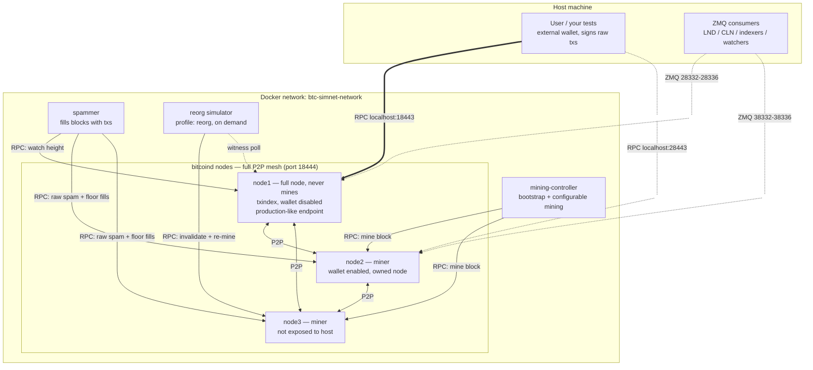

# BTC Simchain

A regtest Bitcoin simulation network that tries to stay as close to mainnet reality as
regtest allows: several P2P-connected nodes, rotating miners, a non-mining full node as
the user endpoint, non-empty blocks, and simulated reorgs, all controlled from a `.env`
file.

## Intro

The objective of this project is to be a tool that helps the user write blockchain
regtest tests in such a way that the code later needs only minimal modifications (or only
configuration, in the best case) to switch to testnet or mainnet.

The network consists of 3 well-connected nodes plus helper containers:

- **Node 1 `btc-simnet-node1`**, exposed to the host (RPC 18443). Simulates a production
  endpoint (`-txindex`, `-disablewallet=1`): like most 3rd-party production nodes there is
  no hot wallet online, so you manage your own keys in an external wallet, obtain the
  outpoints of your addresses' UTxOs and submit externally signed raw transactions; mining
  is not under your control. It never mines. Set `NODE1_DISABLE_WALLET=0` in `.env` if you
  need a wallet on it. Publishes all ZMQ topics on host ports 28332-28336
  (see [ZMQ notifications](#zmq-notifications)).
- **Node 2 `btc-simnet-node2`**, exposed to the host (RPC 28443). Simulates an owned node
  with internal wallet enabled, useful to stack an ordinals wallet or any layer-2 node on
  top that needs internal wallet management. Publishes all ZMQ topics on host ports
  38332-38336, so ZMQ consumers like LND/CLN can use it as their bitcoind backend. This
  node is a miner.
- **Node 3 `btc-simnet-node3`**, NOT exposed to the host. Simulates a node connected via
  p2p but inaccessible to the user. This node is a miner.
- **Mining controller `btc-simnet-mining-controller`**, bootstraps the chain: block 1
  goes to node2's wallet, block 2 to node3's wallet, blocks 3 and 4 fund the user address
  (2 UTxOs of 50 BTC = 100 BTC), then two 50-block funding batches (to node2 then node3)
  and two 50-block maturity batches, ending at height **204**. Because coinbase maturity
  is 100 blocks and node3 is funded last (heights 55-104, maturing 155-204), burying to
  204 leaves **both miner wallets fully liquid at handoff** (~51 mature coinbases,
  ~2550 BTC each) so the spammer never starves; the maturity batches keep maturing during
  the run (heights 205-304). After that the miner nodes produce blocks with bounded
  exponential timing by default (15-second underlying mean, clamped to 10–20 seconds)
  and strict miner alternation. Timing can be switched to fixed and miner selection can
  be weighted independently. Stop this container after funding if you want to control
  mining manually.
- **Spammer `btc-simnet-spammer`**, fills blocks so they are not empty. By default
  (raw engine) it can run in DATA/HYBRID mode — OP_RETURN data txs of varied sizes that
  fill blocks at near-zero node cost, kept `SPAM_FILL_BLOCK_RATIO` blocks deep — or in
  OUTPUT mode, spamming `SPAM_FIXED_TXS_PER_BLOCK` burn-output txs per block. Outputs
  are paid to burn addresses so no wallet fills with dust. In DATA/HYBRID mode it also
  maintains a standing pool of `SPAM_FLOOR_POOL_TXS` standalone ~110-vB floor-priced
  fills, so blocks pack ~100% full and the `FALLBACK_FEE` price floor is **airtight**:
  a below-floor tx waits in the mempool until it outbids the floor, like mainnet under
  congestion. See SETTINGS.md "Spammer".
  On startup it waits for funds to mature and splits them into `SPAM_FANOUT_UTXOS` independent
  UTXOs, otherwise the 25-tx unconfirmed-chain mempool limit would cap spam at 25 txs
  per wallet per block. If you spam many
  transactions, some may stay in the mempool and join the next batch, tune the settings
  to achieve the scenario you need, or disable with `ENABLE_SPAM=false`. With
  `ENABLE_SPAM_REPLACES=true` every spam tx signals RBF and a few per batch get
  fee-bumped, so the mempool carries real BIP125 replacements (see SETTINGS.md).
- **Reorg simulator `btc-simnet-reorg`** *(profile `reorg`, on demand)*, a Rust tool
  (same stack as the other tools, pure RPC calls) that forces chain reorganizations.
  See [Simulating reorgs](#simulating-reorgs).
- **Tools** *(profiles)*, [mempool.space](https://github.com/mempool/mempool) explorer
  and/or [electrs](https://github.com/mempool/electrs). See [Profiles](#profiles).

## Network topology

All containers join a single Docker network (`btc-simnet-network`). The three bitcoind
nodes form a full P2P mesh (`-addnode`, port 18444). The user lives on the host and
talks to **node1**, the non-mining full node, over RPC on `localhost:18443`, exactly like
talking to a 3rd-party production endpoint (node2's RPC on `localhost:28443` is also
exposed, for the "owned node" scenarios).



With the `electrs` / `mempool` / `all-tools` [profiles](#profiles), the explorer stack
also joins the network and indexes the chain through node1:


## Configuration

Everything is driven by `.env`, and **every setting has a default**, the stack runs with
no `.env` file at all. To customize:

```bash
cp .env.example .env        # the most used settings (image, credentials, blocktime, spam)
# or, to tweak everything:
cp .env.full.example .env
```

Every setting (node image, credentials, host ports, fee policy, user address, block
interval, spam volume, reorg behavior, tool images/ports, explorer DB credentials) is
documented with its default in **[SETTINGS.md](./docs/SETTINGS.md)**.

### Choosing the bitcoin node image

By default the stack pulls the official registry image, no build step needed:

```bash
BTC_IMAGE=bitcoin/bitcoin:31.1   # default if unset
```

To use the locally built image instead (arch auto-detected; binaries are
checksum-verified and the SHA256SUMS file's GPG signature is checked against the
Bitcoin Core builder keys from
[bitcoin-core/guix.sigs](https://github.com/bitcoin-core/guix.sigs)):

```bash
./build-bitcoin.sh                        # builds simchainbitcoinnode:<BITCOIN_VERSION>
echo "BTC_IMAGE=simchainbitcoinnode:31.1" >> .env
```

`build-bitcoin.sh` reads `BITCOIN_VERSION` from `.env` (default 31.1). It only builds
the bitcoin node image; the Rust tool images are built by compose itself.

## How to run

```bash
docker compose --profile all-tools up -d
```

That's it (with the default registry image there is nothing to build). Useful follow-ups:

```bash
# Mining logs, find the banner with the funded user address
docker compose logs -ft btc-simnet-mining-controller

# Spammer logs
docker compose logs -ft btc-simnet-spammer

# Reorg simulator logs in auto mode (one-shot runs print to the terminal)
docker compose logs -ft btc-simnet-reorg

# bitcoind logs (node1 = the user-facing endpoint; same for node2/node3)
docker compose logs -ft btc-simnet-node1

# Everything at once
docker compose logs -ft

# Tear down (regtest keeps no volumes; the chain resets on next up)
docker compose --profile all-tools down
```

### Profiles

One compose file serves every combination via
[profiles](https://docs.docker.com/compose/how-tos/profiles/):

| Command | What comes up |
|---|---|
| `docker compose up` | basic simnet: 3 nodes + mining controller + spammer |
| `docker compose --profile basic up` | same as above (alias) |
| `docker compose --profile electrs up` | basic + electrs (Electrum RPC on 60001, HTTP on 3000) |
| `docker compose --profile mempool up` | basic + electrs + mempool.space explorer |
| `docker compose --profile all-tools up` | basic + all the tools above |

With `mempool` or `all-tools`, browse the explorer at
[http://localhost:1080/](http://localhost:1080/) (port: `MEMPOOL_WEB_PORT`).


## Simulating reorgs

The reorg simulator (a Rust container using only bitcoind RPC calls) invalidates the last
*N* blocks on a miner node and mines *N+1* replacements, so the new chain is strictly
longer and **the whole network reorgs to it**. Transactions from the orphaned blocks fall
back to the mempool; each replacement block is filled by re-reading the mempool live and
mining a slice of it with `generateblock`, like the winning chain of a real reorg, so
reorged blocks are not empty. Reading the mempool fresh for each block means an RBF
replacement that evicts an orphaned tx mid-reorg (e.g. with `ENABLE_SPAM_REPLACES=true`)
is picked up automatically. On top of the returned txs it seeds `REORG_ADDS_NEW_TXS` fresh
wallet transactions into the mempool first, modelling a node that received transactions
its peers have not yet seen. It prints each block's hash and tx count before/after plus a
replaced-blocks summary.

Pass `empty` to mine **empty** replacement blocks instead (a chaos reorg that leaves the
orphaned txs unconfirmed): `./simulate-reorg.sh 3 empty`. It is a per-run argument, not a
setting, so a real reorg and an empty one can be issued against the same running chain.

The reorg is race-safe against the mining controller: after mining the replacements the
tool polls a witness node (`REORG_WITNESS_NODE`, default node1) and, if the miners kept
extending the old chain in the meantime, mines extra blocks until the network adopts the
new chain.

The mining controller observes reorgs like a real miner would: it keeps mining on
whatever tip its node reports (so it follows the winning chain automatically) while
remembering the recent chain and which blocks it mined itself. When history is rewritten
it logs a `REORG detected` line with the fork point, the replaced range and the new tip
(the same shape chainwatch reports), and every block it did not mine itself -- the reorg
replacements, or anything generated outside the controller -- is flagged with an
`EXTERNAL block` line, which also explains any height jumps in its log.

One-shot (container runs, reorgs, dies):

```bash
./simulate-reorg.sh 3
# equivalent to:
docker compose run --rm btc-simnet-reorg 3     # depth defaults to REORG_DEPTH (3)
./simulate-reorg.sh 3 empty                    # chaos: mine empty replacement blocks
```

Continuous, every `AUTO_REORG_EVERY_BLOCKS` (x) blocks, reorg `REORG_DEPTH` (y) blocks,
with x > y enforced:

```bash
REORG_MODE=auto docker compose --profile reorg up btc-simnet-reorg
```

Tune `REORG_DEPTH`, `AUTO_REORG_EVERY_BLOCKS`, `REORG_NODE`, `REORG_MINE_ADDRESS`,
`REORG_ADDS_NEW_TXS`, `REORG_WALLET_NAME` and `REORG_WITNESS_NODE` in `.env`
(see [SETTINGS.md](./docs/SETTINGS.md)).

## ZMQ notifications

node1 and node2 publish all five bitcoind ZMQ topics (`rawblock`, `rawtx`, `hashblock`,
`hashtx`, `sequence`): node1 on host ports 28332-28336, node2 on 38332-38336 (all
remappable, see [SETTINGS.md](./docs/SETTINGS.md)). Anything that consumes bitcoind ZMQ
(LND/CLN, indexers, custody watchers) can point at the simnet, and reorg delivery can be
exercised with the reorg simulator. Smoke test (needs `pip install pyzmq`):

```bash
python3 -c "
import zmq
s = zmq.Context().socket(zmq.SUB)
s.connect('tcp://127.0.0.1:28332')      # node1 rawblock
s.setsockopt_string(zmq.SUBSCRIBE, '')
topic, body, seq = s.recv_multipart()   # blocks until the next block is mined
print(topic, len(body), 'bytes')
"
```

## Documents

- [SETTINGS.md](./docs/SETTINGS.md), every setting, its default and what it does.
- [nice-to-have.md](./docs/nice-to-have.md), all limitations, future enhancements and
  proposed features with rationale and implementation plans.
- [runbook.txt](./runbook.txt), handy `bitcoin-cli` one-liners against the simnet.

## Limitations and future enhancements

All known limitations, future enhancements and proposed features live in
[nice-to-have.md](./docs/nice-to-have.md).

# Trouble shotting

Stopping the containers (`docker compose stop`) and starting them again used to crash
the mining controller with:

```
JsonRpc(Rpc(RpcError { code: -4, message: "Wallet file verification failed. Failed to create database path '/home/bitcoin/.bitcoin/regtest/wallets/node2'. Database already exists.", data: None }))
```

Fixed: the controller now loads the existing wallets and skips the funding sequence when
the chain is already bootstrapped (height >= 204), so `stop`/`start` resumes cleanly
where it left off.

To reset the chain from scratch, remove the containers instead:
`docker compose --profile all-tools down` (regtest keeps no volumes; everything resets
on the next `up`).
