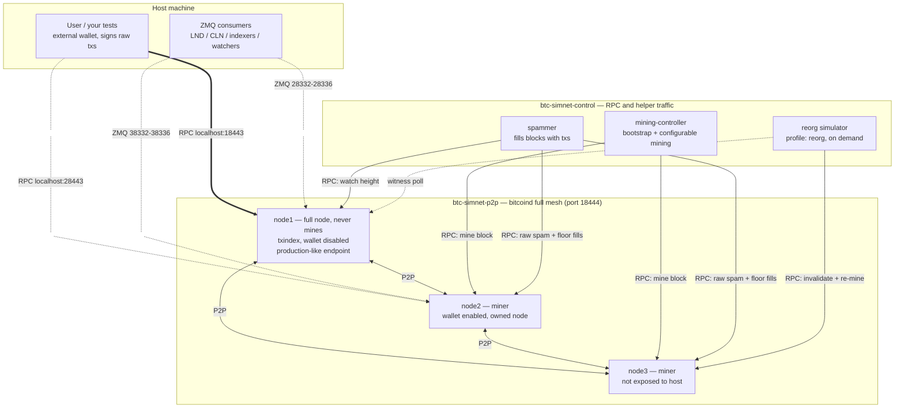
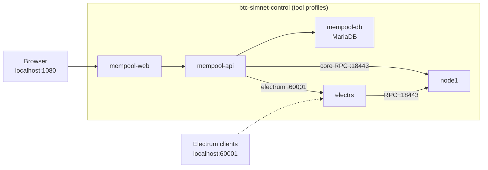

# BTC Simchain

[](https://github.com/danielemiliogarcia/simchain/actions/workflows/ci.yml) [](./LICENSE)

A regtest Bitcoin simulation network that tries to stay as close to mainnet reality as
regtest allows: several P2P-connected nodes, rotating miners, a non-mining full node as
the user endpoint, non-empty blocks, and simulated reorgs, all controlled from a `.env`
file.

## Intro

Blockchain regtest tool that helps write tests needing minimal changes to run on testnet/mainnet.
Three P2P-connected nodes, rotating miners, non-mining user endpoint, non-empty blocks, configurable reorgs.

For detailed component descriptions, see [INTRO.md](./docs/INTRO.md).

## Network topology

Traffic is split across two Docker networks. Only the three bitcoind nodes join
`btc-simnet-p2p`, where `node1-p2p`, `node2-p2p`, and `node3-p2p` form the full P2P
mesh on port 18444. Nodes and helper containers also join `btc-simnet-control` for RPC,
health checks, and explorer traffic. This separation lets P2P links be partitioned or
impaired without losing control access. The user talks to **node1** over RPC on
`localhost:18443`; node2's RPC is also exposed on `localhost:28443`.



With the `electrs` / `mempool` / `all-tools` [profiles](#profiles), the explorer stack
also joins the network and indexes the chain through node1:



## Configuration

Everything is driven by `.env`, and **every setting has a default**, the stack runs with
no `.env` file at all. To customize:

```bash
cp .env.example .env        # the most used settings (image, credentials, blocktime, spam)
# or, to tweak everything:
cp .env.full.example .env
```

Every setting (node image, credentials, host ports, fee policy, user address, block
interval, spam volume, reorg behavior, tool images/ports, explorer DB credentials) is
documented with its default in **[SETTINGS.md](./docs/SETTINGS.md)**.

### Choosing the bitcoin node image

By default the stack pulls the official registry image, no build step needed:

```bash
BTC_IMAGE=bitcoin/bitcoin:31.1   # default if unset
```

To use the locally built image instead (arch auto-detected; binaries are
checksum-verified and the SHA256SUMS file's GPG signature is checked against the
Bitcoin Core builder keys from
[bitcoin-core/guix.sigs](https://github.com/bitcoin-core/guix.sigs)):

```bash
./docker/build-bitcoin-image.sh           # builds simchainbitcoinnode:<BITCOIN_VERSION>
echo "BTC_IMAGE=simchainbitcoinnode:31.1" >> .env
```

`docker/build-bitcoin-image.sh` uses `BITCOIN_VERSION` from the environment or `.env`
(default 31.1). It only builds the bitcoin node image; the Rust tool images are built
by compose itself.

## How to run

```bash
docker compose --profile all-tools up -d
```

That's it (with the default registry image there is nothing to build). Useful follow-ups:

```bash
# Mining logs, find the banner with the funded user address
docker compose logs -ft btc-simnet-mining-controller

# Spammer logs
docker compose logs -ft btc-simnet-spammer

# Reorg simulator logs in auto mode (one-shot runs print to the terminal)
docker compose logs -ft btc-simnet-reorg

# bitcoind logs (node1 = the user-facing endpoint; same for node2/node3)
docker compose logs -ft btc-simnet-node1

# Everything at once
docker compose logs -ft

# Tear down; the chain persists on named volumes and resumes on the next up.
# Let it finish on its own -- see "Chain snapshots" for why force-killing it
# can cost you the chain.
docker compose --profile all-tools down

# Tear down AND wipe the chain (fresh bootstrap on the next up)
docker compose --profile all-tools down -v

# Or in one command: wipe + start a fresh chain (flags are passed to compose)
./scripts/fresh-chain.sh --profile all-tools
```

### Retuning a live chain

Change mining controller and spammer settings without restarting nodes; chain state preserved, only tool containers replaced.
Quickest way to experiment with block cadence, fee floor, and block fill on a live chain.

For full details and caveats, see [RETUNING.md](./docs/RETUNING.md).

### Chain snapshots

The node datadirs live on named volumes, so the chain survives `docker compose down`
and resumes on the next `up` (the mining controller detects the height and skips the
bootstrap); `down -v` wipes it for a fresh chain. On top of that,
`./scripts/snapshot.sh` archives and restores the **full chain state**, blocks, UTXO
set, miner wallets and mempool, so a bootstrapped, funded chain can be brought back in
seconds instead of re-mining and re-funding:

```bash
./scripts/snapshot.sh save mysnap                       # archive the running chain
./scripts/snapshot.sh restore mysnap                    # boot the simnet back at that state
./scripts/snapshot.sh list                              # what is saved
```

> **⚠️ Let `docker compose down`/`stop` finish on their own.** On shutdown bitcoind
> flushes the chainstate and dumps the mempool to `mempool.dat`; the compose file
> gives each node up to 5 minutes (`stop_grace_period: 300s`) to do that, and after a
> heavy spam run it can genuinely take a while. Force-killing the stack instead — a
> second `Ctrl+C`, `docker compose kill`, `docker rm -f` — skips the flush: the
> mempool is lost and the chainstate can be left unusable, and the only way back is a
> snapshot restore or a fresh chain (`./scripts/fresh-chain.sh`, wipes the volumes).
> If you want to resume or snapshot the chain later, always wait for the graceful stop.

A snapshot also records which services were running (tool profiles included), and
restore brings back exactly that shape — no `--profile` flags needed (passing compose
flags overrides it). Because the user's keys live outside the simnet, coins received
on the saved chain are still spendable after a restore with the same external keys.
Snapshots land in `./snapshots/` and are tied to the bitcoind image and wallet names
they were taken with (restore checks and refuses a mismatch).

Recipes for the common situations: **[SNAPSHOTS.md](./docs/SNAPSHOTS.md)**.

### Profiles

One compose file serves every combination via
[profiles](https://docs.docker.com/compose/how-tos/profiles/):

| Command | What comes up |
|---|---|
| `docker compose up` | basic simnet: 3 nodes + mining controller + spammer |
| `docker compose --profile basic up` | same as above (alias) |
| `docker compose --profile electrs up` | basic + electrs (Electrum RPC on 60001, HTTP on 3000) |
| `docker compose --profile mempool up` | basic + electrs + mempool.space explorer |
| `docker compose --profile all-tools up` | basic + all the tools above |

With `mempool` or `all-tools`, browse the explorer at
[http://localhost:1080/](http://localhost:1080/) (port: `MEMPOOL_WEB_PORT`).


## Simulating reorgs

Forces chain reorgs by invalidating N blocks and mining N+1 replacements; orphaned txs fall back to mempool, new blocks rebuilt from live mempool.
Race-safe against mining controller; supports one-shot and continuous modes with configurable depth.

For full details, commands, and modes, see [REORGS.md](./docs/REORGS.md).


## Partitions and P2P latency

Isolates one miner from the P2P mesh (RPC stays up), mines competing branches on both
sides, then heals so the longer branch wins everywhere: an organic reorg caused by the
real mechanism (a partition), unlike the administrative reorg simulator below.
`degrade.sh` makes a node slower and/or lossy for N seconds or blocks (auto-restored);
`netem.sh` underneath gives fine control. P2P traffic only — block/tx propagation
becomes observable, RPC stays clean.

For commands, manual walkthroughs, and caveats, see
[PARTITIONS.md](./docs/PARTITIONS.md).


## ZMQ notifications

node1 and node2 publish all five bitcoind ZMQ topics (`rawblock`, `rawtx`, `hashblock`,
`hashtx`, `sequence`): node1 on host ports 28332-28336, node2 on 38332-38336 (all
remappable, see [SETTINGS.md](./docs/SETTINGS.md)). Anything that consumes bitcoind ZMQ
(LND/CLN, indexers, custody watchers) can point at the simnet, and reorg delivery can be
exercised with the reorg simulator. Smoke test (needs `pip install pyzmq`):

```bash
python3 -c "
import zmq
s = zmq.Context().socket(zmq.SUB)
s.connect('tcp://127.0.0.1:28332')      # node1 rawblock
s.setsockopt_string(zmq.SUBSCRIBE, '')
topic, body, seq = s.recv_multipart()   # blocks until the next block is mined
print(topic, len(body), 'bytes')
"
```

## Repository structure

The three Rust tools live in a single Cargo workspace at the repo root, sharing one
`target/` dir, one dependency resolution, and one committed `Cargo.lock` so every build
of a given commit ships identical dependency versions.

| Path | Purpose |
|---|---|
| [crates/simchain-common](crates/simchain-common) | Shared helpers: RPC client construction (`create_client`) and env lookup (`env_or`), used by all three tools |
| [crates/mining-controller](crates/mining-controller) | Bootstraps the chain and drives configurable mining (`btc-simnet-mining-controller`) |
| [crates/spammer](crates/spammer) | Fills blocks with transactions (`btc-simnet-spammer`) |
| [crates/reorg](crates/reorg) | Forces chain reorganizations on demand (`btc-simnet-reorg`) |

`Cargo.lock` is committed on purpose: these are binaries for a reproducible test
network, so the lockfile is tracked (unlike a library crate, which would leave it to
the consumer).

### Embedding under a parent workspace

The workspace is deliberately embeddable. There is **no `[workspace.dependencies]`
table** — each crate declares its own dependencies, so a parent workspace's version
pins can never conflict with a shared table here. If you embed this repo inside an
upper-level Cargo workspace, that workspace must exclude this directory to avoid
nested-workspace errors:

```toml
[workspace]
exclude = ["path/to/simchain"]
```

## Documents

- [INTRO.md](./docs/INTRO.md), detailed component descriptions and project objective.
- [RETUNING.md](./docs/RETUNING.md), how to retune mining cadence, fee floor, and block fill on a live chain.
- [REORGS.md](./docs/REORGS.md), simulating chain reorganizations, commands, and modes.
- [PARTITIONS.md](./docs/PARTITIONS.md), network partitions and P2P latency: organic
  reorgs, double-spend windows, propagation lag.
- [SETTINGS.md](./docs/SETTINGS.md), every setting, its default and what it does.
- [SNAPSHOTS.md](./docs/SNAPSHOTS.md), chain snapshot/restore cookbook: concrete
  commands for the common situations.
- [snapshot-restore-plan.md](./docs/snapshot-restore-plan.md), chain snapshot/restore
  design, rationale and usage details.
- [NICE-TO-HAVE.md](./docs/NICE-TO-HAVE.md), all limitations, future enhancements and
  proposed features with rationale and implementation plans.
- [RUNBOOK.md](./docs/RUNBOOK.md), handy `bitcoin-cli` one-liners against the simnet.

## Limitations and future enhancements

All known limitations, future enhancements and proposed features live in
[NICE-TO-HAVE.md](./docs/NICE-TO-HAVE.md).

### Local development

All `cargo` commands run from the repo root. Project aliases live in
[.cargo/config.toml](.cargo/config.toml) (Cargo discovers it by walking up from any
crate directory):

CI ([.github/workflows/ci.yml](.github/workflows/ci.yml)) runs `cargo ba`, clippy
(`-D warnings`), `cargo fmt --check`, and the test suite on every pull request, all
with `--locked` so a stale `Cargo.lock` fails the build. The three tool Docker images
build from one shared [docker/tools.Dockerfile](docker/tools.Dockerfile) (one builder
stage, three targets), also with `--locked`.

# Trouble shotting

Stopping the containers (`docker compose stop`) and starting them again used to crash
the mining controller with:

```
JsonRpc(Rpc(RpcError { code: -4, message: "Wallet file verification failed. Failed to create database path '/home/bitcoin/.bitcoin/regtest/wallets/node2'. Database already exists.", data: None }))
```

Fixed: the controller now loads the existing wallets and skips the funding sequence when
the chain is already bootstrapped (height >= 204), so `stop`/`start` resumes cleanly
where it left off.

To reset the chain from scratch, remove the containers **and the chain volumes**:
`docker compose --profile all-tools down -v` (a plain `down` keeps the named volumes,
so the chain resumes on the next `up`).
