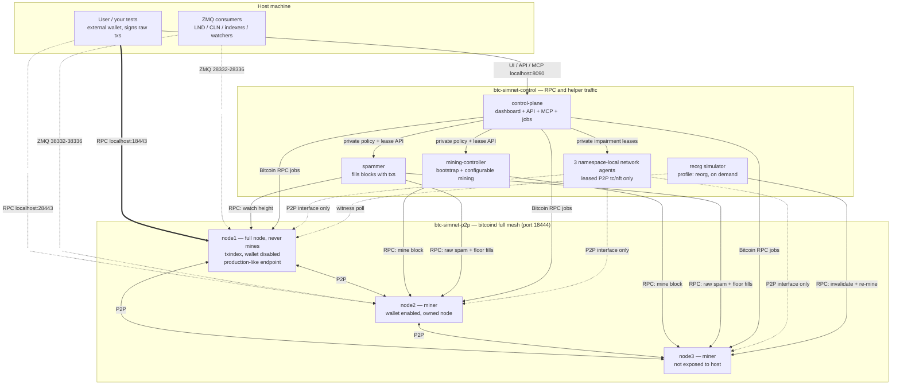
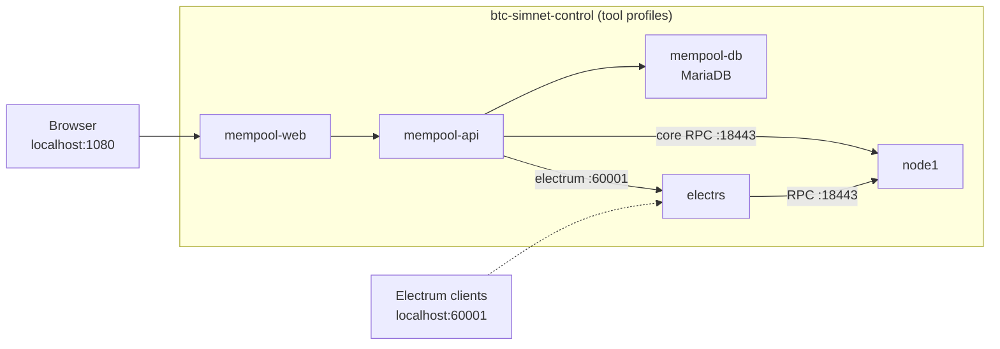

# BTC Simchain

[](https://github.com/danielemiliogarcia/simchain/actions/workflows/ci.yml) [](./LICENSE)

A regtest Bitcoin simulation network that tries to stay as close to mainnet reality as
regtest allows: several P2P-connected nodes, rotating miners, a non-mining full node as
the user endpoint, non-empty blocks, and simulated reorgs. Compose boot infrastructure
comes from `.env`; live policy and experiments are owned by one control plane.

## Intro

Blockchain regtest tool that helps write tests needing minimal changes to run on testnet/mainnet.
Three P2P-connected nodes, rotating miners, non-mining user endpoint, non-empty blocks, configurable reorgs.

For detailed component descriptions, see [INTRO.md](./docs/INTRO.md).

## Scope and non-goals

BTC Simchain is intended to give application developers a disposable blockchain on
which they can fund addresses, broadcast real Bitcoin transactions, observe mempool and
confirmation behavior, and test how wallets, indexers, payment systems, and other
integrations react to fee pressure, replacements, propagation faults, and reorgs.
"Mainnet-like" in this repository refers to those application-facing behaviors, while
still allowing developers to configure Bitcoin policy for the behavior their test
requires.

It is **not** intended to validate:

- Bitcoin consensus implementations, consensus-rule changes, or fork-choice security.
- Miner software, pool protocols, hashpower security, or mining economics.
- Network-scale decentralization, topology, or propagation characteristics.
- Signet behavior. This is regtest and does not implement Signet's block-signing
  challenge.

The topology deliberately uses only three Bitcoin Core nodes and centrally controlled
regtest mining so it remains practical on a developer machine. Bitcoin Core still
enforces regtest consensus rules, and Simchain can create real competing branches or
administratively force reorgs, but those facilities exist to test an application's
reaction to chain events. They do not turn this small, controlled network into a
consensus or miner testbed, and results should not be interpreted as Signet, testnet, or
mainnet network behavior.

## Features

- **Mainnet-like network shape.** Three Bitcoin Core nodes form a full P2P mesh;
  two mine while a wallet-disabled, non-mining node gives applications a
  production-like RPC endpoint.
- **Configurable, reproducible mining.** Choose fixed or bounded-Poisson block
  intervals, strict miner alternation or weighted selection, and an optional RNG
  seed for repeatable runs.
- **Realistic block and fee pressure.** Locally signed raw transactions fill blocks,
  maintain configurable mempool depth and an economic fee floor, and can exercise
  fee replacement without changing Bitcoin Core's mainnet relay or mempool policy.
- **Programmatic reorgs (`invalidateblock`).** Deterministically run one-shot or
  continuous reorgs with configurable depth, rebuild replacement blocks from the
  live mempool, inject new transactions, leave transactions unconfirmed in chaos
  mode, or permanently drop selected transactions through simulated double spends.
- **Network splits and organic reorgs.** Partition the P2P mesh while keeping the RPC
  control plane reachable, let both sides mine competing branches, then heal the
  split and observe every node converge on the most-work chain.
- **P2P link degradation.** Add latency and packet loss for a duration or number of
  blocks, with automatic recovery, to exercise block and transaction propagation
  without impairing RPC traffic.
- **Declarative scenario orchestration.** Check in YAML scenarios that retune live
  policy, wait for chain or mempool conditions, pause/resume mining, fund wallets,
  mine blocks, run spam bursts, trigger reorgs, create partitions, degrade links, and
  expose durable checkpoints for CI.
- **Built-in regtest faucet.** Fund one or many application addresses from miner
  treasury coins through the same dashboard, CLI, HTTP API, MCP, and scenario job
  coordinator.
- **Reusable chain snapshots.** Named volumes make bootstrap resumable; validated
  snapshots preserve blocks, chainstate, miner wallets, the mempool, and the active
  Compose profile for fast restoration.
- **First-party control dashboard.** Watch chain status, retune mining/spam behavior,
  pause workers, start jobs, inspect job progress, use the faucet, and jump to the
  local mempool.space explorer when it is enabled.
- **CLI interface.** Automate control-plane operations from `simchainctl` with stable
  commands and exit codes for humans, scripts, and CI.
- **HTTP API.** Drive the same dashboard and job operations through a versioned
  localhost API with token-protected mutation routes.
- **MCP interface.** Let coding agents inspect, retune, and operate the simnet through
  the control plane's streamable HTTP MCP endpoint.
- **Application integration.** Use Bitcoin Core RPC, all five ZMQ topics, optional
  Electrum RPC, and an optional local mempool.space explorer connected to node1.
- **Live hot-reloaded configuration.** Retune mining cadence, miner selection, spam
  fill, fee floor, and worker pause/resume state on a running chain without restarting
  Bitcoin nodes or helper services.

## Network topology

Traffic is split across two Docker networks. Only the three bitcoind nodes join
`btc-simnet-p2p`, where `node1-p2p`, `node2-p2p`, and `node3-p2p` form the full P2P
mesh on port 18444. Nodes, workers, and the control plane also join
`btc-simnet-control` for RPC, private APIs, health checks, and explorer traffic;
namespace-local agents share their node's two interfaces. This separation lets P2P
links be partitioned or impaired without losing control access. The user talks to
**node1** over RPC on `localhost:18443`; node2's RPC is also exposed on
`localhost:28443`.



With the `electrs` / `mempool` / `all-tools` [profiles](#profiles), the explorer stack
also joins the network and indexes the chain through node1:



## Configuration

Simchain has two configuration layers:

1. **Bootstrap / Compose config** lives in `.env`. Every Compose boot setting has a
   default, so the stack runs with no `.env` file. Use it for images, credentials, host
   ports, node policy, wallet names, explorer ports, faucet limits, and the initial
   mining/spam policy. Editing `.env` does not mutate a running stack; recreate the
   relevant containers when changing boot settings.
2. **Runtime desired config** lives in the control plane's `btc-simnet-control-state`
   Docker volume after first startup. The control plane stores it as `state.json` with a
   generation plus manual mining/spam desired state. Change it through the dashboard,
   `simchainctl config set KEY=VALUE`, HTTP, or MCP. The control plane never rewrites
   `.env`, and once this state exists, `.env` no longer overrides live mining/spam
   desired policy.

Use `.env` when you want to customize bootstrap values:

```bash
cp .env.example .env        # the most used settings (image, credentials, blocktime, spam)
# or, to tweak everything:
cp .env.full.example .env
```

Every setting and its ownership is documented in **[SETTINGS.md](./docs/SETTINGS.md)**.

### Choosing the bitcoin node image

By default the stack pulls the official registry image, no build step needed:

```bash
BTC_IMAGE=bitcoin/bitcoin:31.1   # default if unset
```

To use the locally built image instead (arch auto-detected; binaries are
checksum-verified and the SHA256SUMS file's GPG signature is checked against the
Bitcoin Core builder keys from
[bitcoin-core/guix.sigs](https://github.com/bitcoin-core/guix.sigs)):

```bash
./docker/build-bitcoin-image.sh           # builds simchainbitcoinnode:<BITCOIN_VERSION>
echo "BTC_IMAGE=simchainbitcoinnode:31.1" >> .env
```

`docker/build-bitcoin-image.sh` uses `BITCOIN_VERSION` from the environment or `.env`
(default 31.1). It only builds the bitcoin node image; the Rust tool images are built
by compose itself.

## How to run

```bash
docker compose up -d --build
```

That's it (with the default registry image there is nothing to build). Useful follow-ups:

```bash
# Mining logs, find the banner with the funded user address
docker compose logs -ft btc-simnet-mining-controller

# Spammer logs
docker compose logs -ft btc-simnet-spammer

# Reorg simulator logs in auto mode (one-shot runs print to the terminal)
docker compose logs -ft btc-simnet-reorg

# bitcoind logs (node1 = the user-facing endpoint; same for node2/node3)
docker compose logs -ft btc-simnet-node1

# Everything at once
docker compose logs -ft

# Tear down every profile; the chain persists on named volumes and resumes on
# the next up. The quoted wildcard also catches reorg/partition helper containers.
# Let it finish on its own -- see "Chain snapshots" for why force-killing it
# can cost you the chain.
docker compose --profile "*" down

# Tear down AND wipe the chain (fresh bootstrap on the next up)
docker compose --profile "*" down -v

# Or in one command: wipe + start a fresh chain (flags are passed to compose)
./scripts/fresh-chain.sh --profile all-tools
```

### Retuning a live chain

Change mining-controller and spammer settings without restarting nodes or either
worker; chain state and worker identity are preserved. This is the quickest way to
experiment with block cadence, fee floor, and block fill on a live chain.

For full details and caveats, see [RETUNING.md](./docs/RETUNING.md).

### Chain snapshots

The node datadirs live on named volumes, so the chain survives `docker compose down`
and resumes on the next `up` (the mining controller detects the height and skips the
bootstrap); `down -v` wipes it for a fresh chain. On top of that,
`./scripts/snapshot.sh` archives and restores the **full chain state**, blocks, UTXO
set, miner wallets and mempool, so a bootstrapped, funded chain can be brought back in
seconds instead of re-mining and re-funding:

```bash
./scripts/snapshot.sh save mysnap                       # archive the running chain
./scripts/snapshot.sh restore mysnap                    # boot the simnet back at that state
./scripts/snapshot.sh list                              # what is saved
```

> **⚠️ Let `docker compose down`/`stop` finish on their own.** On shutdown bitcoind
> flushes the chainstate and dumps the mempool to `mempool.dat`; the compose file
> gives each node up to 5 minutes (`stop_grace_period: 300s`) to do that, and after a
> heavy spam run it can genuinely take a while. Force-killing the stack instead — a
> second `Ctrl+C`, `docker compose kill`, `docker rm -f` — skips the flush: the
> mempool is lost and the chainstate can be left unusable, and the only way back is a
> snapshot restore or a fresh chain (`./scripts/fresh-chain.sh`, wipes the volumes).
> If you want to resume or snapshot the chain later, always wait for the graceful stop.

A snapshot also records which services were running (tool profiles included), and
restore brings back exactly that shape — no `--profile` flags needed (passing compose
flags overrides it). Because the user's keys live outside the simnet, coins received
on the saved chain are still spendable after a restore with the same external keys.
Snapshots land in `./snapshots/` and are tied to the bitcoind image and wallet names
they were taken with (restore checks and refuses a mismatch).

Recipes for the common situations: **[SNAPSHOTS.md](./docs/SNAPSHOTS.md)**.

### Profiles

One compose file serves every combination via
[profiles](https://docs.docker.com/compose/how-tos/profiles/):

| Command | What comes up |
|---|---|
| `docker compose up` | basic simnet + 3 private network agents + control plane/dashboard |
| `docker compose --profile basic up` | same as above (alias) |
| `docker compose --profile electrs up` | basic + electrs (Electrum RPC on 60001, HTTP on 3000) |
| `docker compose --profile mempool up` | basic + electrs + mempool.space explorer |
| `docker compose --profile all-tools up` | basic + all long-running tools above |

With `mempool` or `all-tools`, browse the explorer at
[http://localhost:1080/](http://localhost:1080/) (port: `MEMPOOL_WEB_PORT`).

The core services have no `profiles` entry, so they are available both to plain
`docker compose up` and whenever any profile is enabled. The `reorg` profile stays
separate because it is a disruptive on-demand helper; including it in `all-tools` would
run it during an ordinary startup. To stop and remove containers from every profile,
including helper containers left by an earlier run, use
`docker compose --profile "*" down`.

## Simchain control plane

The default Compose stack includes a localhost control plane for hot operation: browse
the dashboard at [http://localhost:8090/](http://localhost:8090/) (`CONTROL_PLANE_PORT`)
to watch the chain and manage live settings/jobs, or use the first-party CLI
`simchainctl` for the same API-backed operations from a terminal. It also exposes HTTP
and MCP endpoints, coordinates bounded mutation jobs, and stores its state in the
`btc-simnet-control-state` volume; see **[CONTROL_PLANE.md](./docs/CONTROL_PLANE.md)**
for dashboard, CLI, API, MCP, auth, and job details.

## Scenarios

Reproduce an ordered chain history from YAML after the simnet has bootstrapped:

```bash
docker compose up -d --build
cargo run -p simchainctl -- scenario run scenarios/reorg-during-sync.yml \
  --result results/reorg.json
```

The control plane validates the document before reserving its single mutation coordinator,
waits for height 204, persists step events/results, and cleans only job-owned leases. Named
checkpoints let CI hold an exact state, run external assertions, and release by generation;
disconnecting the client does not cancel the job. Schema, checkpoint workflow, cleanup,
and examples are in [SCENARIOS.md](./docs/SCENARIOS.md).

## Simulating reorgs

The primary control-plane job forces a reorg by invalidating N blocks and mining N+1
replacements. It owns worker pause leases, rebuilds replacement blocks from the live
mempool, witnesses convergence, and records cleanup. A lower-level standalone RPC tool
also remains available for one-shot and continuous experiments.

For full details, commands, and modes, see [REORGS.md](./docs/REORGS.md).


## Partitions and P2P latency

Isolates one miner from the P2P mesh (RPC stays up), mines competing branches on both
sides, then heals so the longer branch wins everywhere: an organic reorg caused by the
real mechanism (a partition), unlike the administrative reorg simulator below.
`degrade` makes a node slower and/or lossy for a bounded number of seconds. Both faults
are lease-owned and target P2P traffic only — block/tx propagation becomes observable,
RPC stays clean.

For commands, manual walkthroughs, and caveats, see
[PARTITIONS.md](./docs/PARTITIONS.md).


## ZMQ notifications

node1 and node2 publish all five bitcoind ZMQ topics (`rawblock`, `rawtx`, `hashblock`,
`hashtx`, `sequence`): node1 on host ports 28332-28336, node2 on 38332-38336 (all
remappable, see [SETTINGS.md](./docs/SETTINGS.md)). Anything that consumes bitcoind ZMQ
(LND/CLN, indexers, custody watchers) can point at the simnet, and reorg delivery can be
exercised with the reorg simulator. Smoke test (needs `pip install pyzmq`):

```bash
python3 -c "
import zmq
s = zmq.Context().socket(zmq.SUB)
s.connect('tcp://127.0.0.1:28332')      # node1 rawblock
s.setsockopt_string(zmq.SUBSCRIBE, '')
topic, body, seq = s.recv_multipart()   # blocks until the next block is mined
print(topic, len(body), 'bytes')
"
```

## Repository structure

The Rust tools live in a single Cargo workspace at the repo root, sharing one
`target/` dir, one dependency resolution, and one committed `Cargo.lock` so every build
of a given commit ships identical dependency versions.

| Path | Purpose |
|---|---|
| [crates/simchain-common](crates/simchain-common) | Shared helpers and public/internal API DTOs |
| [crates/mining-controller](crates/mining-controller) | Bootstraps the chain and drives configurable mining (`btc-simnet-mining-controller`) |
| [crates/network-agent](crates/network-agent) | Private namespace-local P2P impairment agent with TTL healing |
| [crates/spammer](crates/spammer) | Fills blocks with transactions (`btc-simnet-spammer`) |
| [crates/reorg](crates/reorg) | Forces chain reorganizations on demand (`btc-simnet-reorg`) |
| [crates/scenario-engine](crates/scenario-engine) | Pure scenario schema/executor library and thin HTTP client binary |
| [crates/control-plane](crates/control-plane) | Single dashboard/API/MCP backend and durable job coordinator |
| [crates/simchainctl](crates/simchainctl) | Thin first-party HTTP client for humans and CI |

`Cargo.lock` is committed on purpose: these are binaries for a reproducible test
network, so the lockfile is tracked (unlike a library crate, which would leave it to
the consumer).

### Embedding under a parent workspace

The workspace is deliberately embeddable. There is **no `[workspace.dependencies]`
table** — each crate declares its own dependencies, so a parent workspace's version
pins can never conflict with a shared table here. If you embed this repo inside an
upper-level Cargo workspace, that workspace must exclude this directory to avoid
nested-workspace errors:

```toml
[workspace]
exclude = ["path/to/simchain"]
```

## Documents

- [INTRO.md](./docs/INTRO.md), detailed component descriptions and project objective.
- [RETUNING.md](./docs/RETUNING.md), how to retune mining cadence, fee floor, and block fill on a live chain.
- [MCP.md](./docs/MCP.md), connecting coding agents to the Simchain MCP endpoint.
- [REORGS.md](./docs/REORGS.md), simulating chain reorganizations, commands, and modes.
- [PARTITIONS.md](./docs/PARTITIONS.md), network partitions and P2P latency: organic
  reorgs, double-spend windows, propagation lag.
- [SCENARIOS.md](./docs/SCENARIOS.md), declarative scenario schema, execution, and examples.
- [SETTINGS.md](./docs/SETTINGS.md), every setting, its default and what it does.
- [SNAPSHOTS.md](./docs/SNAPSHOTS.md), chain snapshot/restore cookbook: concrete
  commands for the common situations.
- [NICE-TO-HAVE.md](./docs/NICE-TO-HAVE.md), all limitations, future enhancements and
  proposed features with rationale and implementation plans.
- [RUNBOOK.md](./docs/RUNBOOK.md), handy `bitcoin-cli` one-liners against the simnet.

## Limitations and future enhancements

All known limitations, future enhancements and proposed features live in
[NICE-TO-HAVE.md](./docs/NICE-TO-HAVE.md).

## Contributing

Bug reports, documentation, tests, reviews, and code contributions are welcome. For
a new feature or broad behavioral change, please
[open an issue](https://github.com/danielemiliogarcia/simchain/issues) first so the
use case and its effect on mainnet fidelity can be agreed before implementation.
Small, self-contained fixes can go directly to a pull request.

Keep pull requests focused and explain both what changed and why. Preserve the
project's intent: the tools should imitate mainnet behavior, so do not introduce
relay, mempool, or capacity policy that diverges from Bitcoin Core's mainnet
defaults. Put a helper in `crates/simchain-common` as soon as a second tool needs it,
and update tests, `.env` examples, and documentation whenever behavior or settings
change.

### Development workflow

All `cargo` commands run from the repo root. Project aliases live in
[.cargo/config.toml](.cargo/config.toml) (Cargo discovers it by walking up from any
crate directory). Before opening a pull request, format the workspace and run the
same checks as CI:

```bash
cargo fa
cargo ba && cargo ca && cargo fac && cargo tt
```

CI ([.github/workflows/ci.yml](.github/workflows/ci.yml)) runs `cargo ba`, clippy
(`-D warnings`), `cargo fmt --check`, and the test suite on every pull request, all
with `--locked` so a stale `Cargo.lock` fails the build. All Rust-tool images build from
one shared [docker/tools.Dockerfile](docker/tools.Dockerfile), also with `--locked`.
CI renders the Compose trust boundary, builds every final target, and inspects the
control-plane root filesystem for forbidden lifecycle tooling.

If dependencies change, commit the updated `Cargo.lock`. For Compose, Dockerfile, or
shell-script changes, also run `docker compose config --quiet` and exercise the
affected profile or script. In the pull request, link any relevant issue and list the
automated checks and manual scenarios you ran. By submitting a contribution, you
agree that it may be distributed under the project's `GPL-3.0-or-later` license.

## Troubleshooting

Stopping the containers (`docker compose stop`) and starting them again used to crash
the mining controller with:

```
JsonRpc(Rpc(RpcError { code: -4, message: "Wallet file verification failed. Failed to create database path '/home/bitcoin/.bitcoin/regtest/wallets/node2'. Database already exists.", data: None }))
```

Fixed: the controller now loads the existing wallets and skips the funding sequence when
the chain is already bootstrapped (height >= 204), so `stop`/`start` resumes cleanly
where it left off.

To reset the chain from scratch, remove the containers **and the chain volumes**:
`docker compose --profile "*" down -v` (a plain `down` keeps the named volumes,
so the chain resumes on the next `up`).

## License

BTC Simchain's source code is licensed under the
[GNU General Public License version 3 or later](./LICENSE)
(`GPL-3.0-or-later`). Third-party dependencies and optional container images remain
under their respective licenses.
