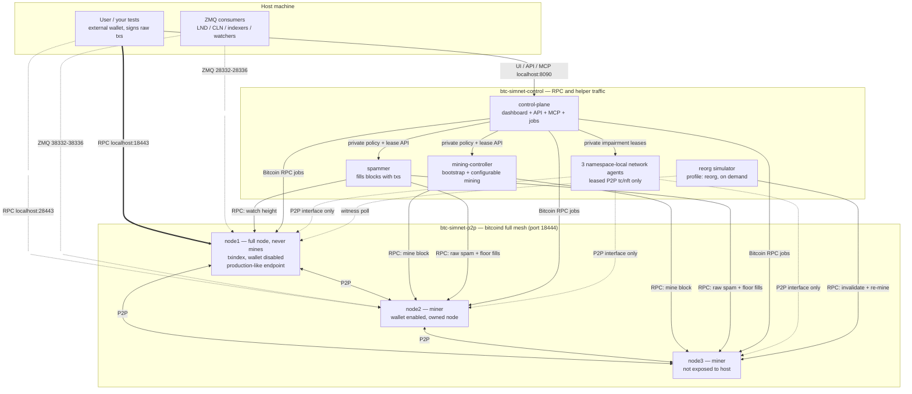
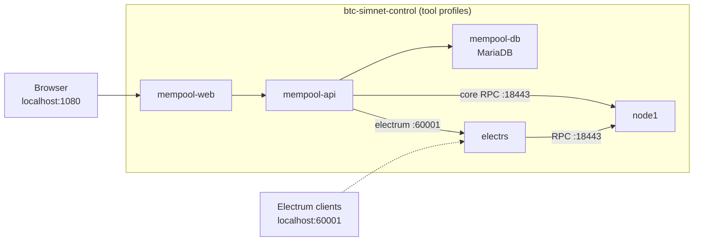

# Network topology

The [README](../README.md#network-topology-overview) shows the same picture with each
Docker network collapsed into a single box. This document expands those boxes into every
container and every link between them.

Traffic is split across two Docker networks. Only the three bitcoind nodes join
`btc-simnet-p2p`, where `node1-p2p`, `node2-p2p`, and `node3-p2p` form the full P2P
mesh on port 18444. Nodes, workers, and the control plane also join
`btc-simnet-control` for RPC, private APIs, health checks, and explorer traffic;
namespace-local agents share their node's two interfaces. This separation lets P2P
links be partitioned or impaired without losing control access. The user talks to
**node1** over RPC on `localhost:18443`; node2's RPC is also exposed on
`localhost:28443`.

## Nodes, workers, and the control plane

Not every container above is present in every stack: the control plane, the network
agents and the reorg simulator each arrive with a profile. See
[Profiles](../README.md#profiles) for which tier starts what.

## Explorer stack

With the `electrs` / `mempool` / `all-tools` [profiles](../README.md#profiles), the
explorer stack also joins the network and indexes the chain through node1:

