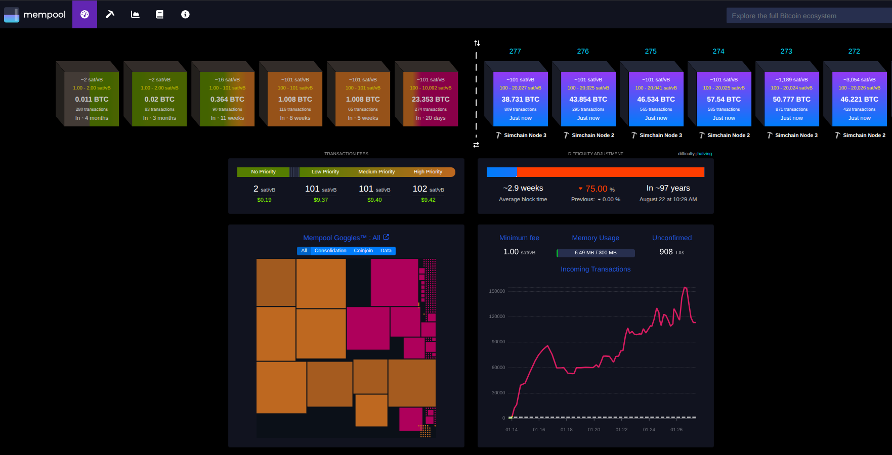

# Declarative scenarios

Scenarios are validated and executed as durable jobs by the Simchain control plane. The
client that submits a file may exit or disconnect without cancelling execution. At most
one mutation job runs at a time, and each job records ordered progress events, owned
leases, checkpoints, its result, and cleanup outcome.

## Run a scenario

Start the simnet and control plane, then submit a version-1 YAML file with the first-party
client. Scenarios are a control-plane feature, so `minimal-api` is the smallest profile
that can run one; a plain `docker compose up` is the chain-only `minimal` profile and has
no control plane at all. Scenarios containing a `partition` or `degrade` step need
`--profile minimal-organic-reorg` (or `basic`) for the network agents.

```bash
docker compose --profile minimal-api up -d --build
cargo run -p simchainctl -- scenario schema --step spam_burst
cargo run -p simchainctl -- scenario validate scenarios/reorg-during-sync.yml
cargo run -p simchainctl -- scenario explain scenarios/reorg-during-sync.yml
cargo run -p simchainctl -- scenario run scenarios/reorg-during-sync.yml \
  --result results/reorg.json
```

`scenario schema` prints the language reference below, for one step with `--step` or for
everything at once. `scenario validate` and `scenario explain` parse the file locally
without uploading it.
`scenario run` uploads the file, streams new events, waits for the terminal state, and
uses stable automation exit codes. The optional result artifact contains the complete
terminal job, checkpoint summaries, and persisted event history.

Every scenario waits for node1 to reach bootstrap height 204 before step 1. Pre-bootstrap
history mutation remains unsupported because bootstrap funding stages use fixed heights.

Scenarios cover hot control-plane actions: runtime retuning, config assertions, faucet
funding, manual mining, spam bursts, reorgs, partitions, timed degradation, and
checkpoints. They still do not own Docker lifecycle or chain-volume deletion. Start from
a fresh chain outside the control plane when the test requires one, then run the scenario.

## Schema

The language describes itself. The same document rendered under
[Step reference](#step-reference) is served as JSON at `GET /api/v1/scenario/schema`,
offered to agents as the `get_scenario_schema` MCP tool, and printed by
`simchainctl scenario schema --json`. All four come from one catalog in the scenario
engine, which is pinned to the `Step` enum by tests, so a new step or a renamed field
cannot leave any of them behind. Read the schema instead of guessing field names.

The [Step reference](#step-reference) below is generated output, not prose kept up by
hand. Regenerate it with `simchainctl scenario schema --markdown` and replace the block
between the `GENERATED STEP REFERENCE` markers; a test fails while the committed text and
the catalog disagree.

Note that `version: 1` refers to the scenario file format, which has never been revised.
It is unrelated to the control plane's persisted job-store `schema_version`.

Every file has exactly `version: 1` and an ordered `steps` list. The optional top-level
`restore_settings: true` makes `set_config` changes temporary. Unknown fields and step
types are rejected before the mutation coordinator is reserved. Existing version-1 files
remain valid because restoration defaults to false.

```yaml
version: 1
restore_settings: true
steps:
  - type: wait_height
    height: 260

  - type: wait_n_blocks
    n: 10

  - type: sleep
    secs: 5

  - type: pause_mining

  - type: mine
    node: btc-simnet-node2
    blocks: 3

  - type: spam_burst
    node: btc-simnet-node2
    txs: 100
    outputs_per_tx: 25

  - type: set_config
    settings:
      BLOCK_INTERVAL_MODE: fixed
      BLOCK_INTERVAL_MEAN_SECS: 10
      SPAM_FILL_BLOCK_RATIO: 4
      SPAM_FEE: 0.002

  - type: assert_config
    effective: true
    settings:
      BLOCK_INTERVAL_MODE: fixed
      BLOCK_INTERVAL_MEAN_SECS: 10
      SPAM_FILL_BLOCK_RATIO: 4
      SPAM_FEE: 0.002

  - type: wait_until
    timeout_secs: 120
    condition:
      kind: component
      component: spam
      status: active

  - type: wait_tx
    txid_env: TARGET_TXID
    state: confirmed
    confirmations: 2
    timeout_secs: 600

  - type: assert_height
    at_least: 205

  - type: assert_component
    component: mining
    reachable: true
    effective_state: running

  - type: faucet
    source: auto
    wait_confirmed: true
    timeout_secs: 900
    outputs:
      - address_env: FUND_ADD_1
        amount: 1btc
      - address: bcrt1q...
        amount: 25000000sat

  - type: checkpoint
    name: mempool_loaded
    timeout_secs: 600

  - type: reorg
    depth: 2
    empty: false
    node: node3
    adds_new_txs: 0
    double_spend_pct: 0

  - type: partition
    node: btc-simnet-node3
    main_blocks: 3
    isolated_blocks: 5

  - type: degrade
    node: node2
    delay_ms: 500
    loss_pct: 1
    seconds: 60

  - type: degrade
    node: node2
    delay_ms: 500
    until_height: 260

  - type: resume_mining
```

## Step reference

<!-- BEGIN GENERATED STEP REFERENCE -->
Generated from the engine catalog by `simchainctl scenario schema --markdown`.
Every scenario file declares `version: 1` and waits for node1 to reach
height 204 before step 1.

### Steps at a glance

| Step | Purpose | Needs |
|---|---|---|
| [`wait_height`](#wait_height) | Waits until node1 reaches an absolute chain height. | control plane |
| [`wait_n_blocks`](#wait_n_blocks) | Waits for `n` more blocks than node1 has when the step starts. | control plane |
| [`wait_until`](#wait_until) | Polls a condition until it holds or the timeout expires. | control plane |
| [`wait_tx`](#wait_tx) | Waits for one caller-supplied transaction to reach a target state. | control plane |
| [`assert_height`](#assert_height) | Asserts node1's current height without waiting. | control plane |
| [`assert_component`](#assert_component) | Asserts a component's reported state without waiting. | control plane |
| [`sleep`](#sleep) | Waits a fixed wall-clock duration. | control plane |
| [`pause_mining`](#pause_mining) | Takes a job-owned mining lease and holds block production paused. | control plane |
| [`resume_mining`](#resume_mining) | Releases the mining lease taken by `pause_mining`. | control plane |
| [`mine`](#mine) | Mines a fixed number of blocks on one miner node. | control plane |
| [`reorg`](#reorg) | Creates a deterministic chain reorganization. | control plane |
| [`spam_burst`](#spam_burst) | Broadcasts a burst of raw transactions from a dedicated engine. | control plane |
| [`set_config`](#set_config) | Applies a partial runtime desired-state patch. | control plane |
| [`assert_config`](#assert_config) | Asserts runtime configuration values. | control plane |
| [`faucet`](#faucet) | Funds addresses from a miner node wallet. | control plane |
| [`partition`](#partition) | Splits one node off the network, builds competing branches, then heals. | network agents (`minimal-organic-reorg`) |
| [`degrade`](#degrade) | Applies bounded network impairment to one node, then releases it. | network agents (`minimal-organic-reorg`) |
| [`checkpoint`](#checkpoint) | Records a durable milestone, and by default pauses until released. | control plane |

### `wait_height`

Waits until node1 reaches an absolute chain height.

| Field | Type | Required | Default | Notes |
|---|---|---|---|---|
| `height` | `integer` | yes | — | Target height; at least 204. Returns immediately when the chain is already past it. |

Absolute. Prefer `wait_n_blocks` unless the test genuinely needs a fixed height, because an absolute target behaves differently on a fresh chain than on one that has been running for hours.

### `wait_n_blocks`

Waits for `n` more blocks than node1 has when the step starts.

| Field | Type | Required | Default | Notes |
|---|---|---|---|---|
| `n` | `integer` | yes | — | Positive number of additional blocks. |

Relative, so the same file behaves the same way regardless of the chain's current height. This is the right default for "N more blocks from here".

### `wait_until`

Polls a condition until it holds or the timeout expires.

| Field | Type | Required | Default | Notes |
|---|---|---|---|---|
| `condition` | [`wait_condition`](#wait_condition) object | yes | — | Predicate to poll, tagged by `kind`. |
| `timeout_secs` | `integer` | no | `900` | Positive. Failing the timeout fails the step and the job. |

### `wait_tx`

Waits for one caller-supplied transaction to reach a target state.

| Field | Type | Required | Default | Notes |
|---|---|---|---|---|
| `txid` | `string` | exactly one of *transaction* | — | 64 hexadecimal characters. Quote it in YAML, because an all-digit hex string is otherwise parsed as a number. |
| `txid_env` | `string` | exactly one of *transaction* | — | Environment variable holding the txid. Alphanumerics and `_` only. |
| `state` | `seen` \| `mempool` \| `confirmed` \| `missing` | no | `confirmed` | Target state to wait for. |
| `confirmations` | `integer` | no | `1` | Positive, and only valid with `state: confirmed`. |
| `timeout_secs` | `integer` | no | `900` | Positive. |

Lets the scenario itself decide when to continue from a transaction the application under test broadcast, without indexing or tagging every transaction. Use a `checkpoint` instead when an external caller should make that decision.

Combines with `reorg` to test orphaning: wait for `confirmed` with two confirmations, run an empty reorg deep enough to orphan it, then wait for `state: mempool`.

### `assert_height`

Asserts node1's current height without waiting.

| Field | Type | Required | Default | Notes |
|---|---|---|---|---|
| `equals` | `integer` | at least one of *condition* | — | Exact height. Cannot be combined with `at_least` or `at_most`. |
| `at_least` | `integer` | at least one of *condition* | — | Inclusive lower bound; must not exceed `at_most`. |
| `at_most` | `integer` | at least one of *condition* | — | Inclusive upper bound. |

### `assert_component`

Asserts a component's reported state without waiting.

| Field | Type | Required | Default | Notes |
|---|---|---|---|---|
| `component` | `mining` \| `spam` \| `network-agent-node1` \| `network-agent-node2` \| `network-agent-node3` | yes | — | Which component the expectation reads. |
| `reachable` | `boolean` | at least one of *expectation* | — | Whether the control plane can reach the component's internal API. |
| `status` | `string` | at least one of *expectation* | — | Reported component status string, for example `active`. |
| `phase` | `string` | at least one of *expectation* | — | Reported worker phase string. |
| `desired_state` | `running` \| `paused` | at least one of *expectation* | — | Durable desired state recorded by the control plane. |
| `effective_state` | `running` \| `paused` | at least one of *expectation* | — | State the worker currently exposes, which lags desired state across a safe point. |
| `effective_generation` | `integer` | at least one of *expectation* | — | Desired-state generation the worker has applied. |
| `observed_height_at_least` | `integer` | at least one of *expectation* | — | Minimum chain height the component reports having observed. |
| `active_lease_count` | `integer` | at least one of *expectation* | — | Number of job-owned leases currently held against the component. |
| `cycle_phase` | `string` | at least one of *expectation* | — | Reported position within the component's work cycle. |

At least one expectation beyond `component` must be set, otherwise the step asserts nothing and the file is rejected.

### `sleep`

Waits a fixed wall-clock duration.

| Field | Type | Required | Default | Notes |
|---|---|---|---|---|
| `secs` | `integer` | yes | — | Positive seconds. |

Prefer `wait_until` or `wait_n_blocks` where a real condition exists; a sleep that is long enough on one machine can be too short on another.

### `pause_mining`

Takes a job-owned mining lease and holds block production paused.

Takes no fields.

The lease is released by a later `resume_mining` step or by cleanup when the job ends, so a failed scenario never leaves mining paused.

### `resume_mining`

Releases the mining lease taken by `pause_mining`.

Takes no fields.

### `mine`

Mines a fixed number of blocks on one miner node.

| Field | Type | Required | Default | Notes |
|---|---|---|---|---|
| `node` | `btc-simnet-node2` \| `btc-simnet-node3` | yes | — | Miner node. `node2` and `node3` are accepted aliases. node1 refuses mining RPCs and cannot be used. |
| `blocks` | `integer` | yes | — | Positive block count. |

Pair with `pause_mining` when the test needs the manual blocks to be the only ones produced.

### `reorg`

Creates a deterministic chain reorganization.

| Field | Type | Required | Default | Notes |
|---|---|---|---|---|
| `depth` | `integer` | yes | — | Blocks to orphan; 1 through 100. |
| `empty` | `boolean` | no | `false` | Replacement blocks carry no transactions beyond the coinbase. |
| `node` | `btc-simnet-node2` \| `btc-simnet-node3` | no | `btc-simnet-node3` | Node that builds the replacement branch. |
| `adds_new_txs` | `integer` | no | `0` | At most 10000. Prioritizes fresh wallet transactions into the replacement blocks. |
| `double_spend_pct` | `integer` | no | `0` | 0 through 100. Exposes the permanent-drop conflict path, where orphaned transactions do not return to the mempool. |

Takes both mining and spam leases, and witnesses strict node1 convergence before the step completes. Fields match `simchainctl reorg start`.

### `spam_burst`

Broadcasts a burst of raw transactions from a dedicated engine.

| Field | Type | Required | Default | Notes |
|---|---|---|---|---|
| `node` | `btc-simnet-node2` \| `btc-simnet-node3` | yes | — | Node whose wallet funds the burst engine. |
| `txs` | `integer` | yes | — | Positive transaction count. Also sets how many confirmed branches the job funds up front, since a burst reserves one branch per transaction. |
| `outputs_per_tx` | `integer` | yes | — | May be zero. Zero sends sequential single-output transactions; a positive value sends that many 546-sat burn outputs per transaction. |

Bursts run on a dedicated raw engine — locally signed, submitted with `sendrawtransaction`, priced from the live `SPAM_FEE` — so no coin-selection or signing load lands on the miner node wallets.

The job funds every burst engine before step 1 runs, while mining still produces blocks, because funding needs confirmations and scenarios often pause mining before their first burst. A `set_config` step that changes spam policy refunds the bursts still ahead of it.

### `set_config`

Applies a partial runtime desired-state patch.

| Field | Type | Required | Default | Notes |
|---|---|---|---|---|
| `settings` | `string_map` | yes | — | Non-empty map using the same keys as `simchainctl config set`. Values may be strings, numbers, booleans, or null/empty reset values. Keys must not be blank. |

Uses the same validation, worker apply, verification, persistence, and rollback path as the dashboard and CLI.

With top-level `restore_settings: true`, the complete pre-scenario desired map is durably captured before execution and restored after success, failure, abort, panic, or control-plane restart. Config mutation stays blocked until restoration completes.

### `assert_config`

Asserts runtime configuration values.

| Field | Type | Required | Default | Notes |
|---|---|---|---|---|
| `settings` | `string_map` | yes | — | Non-empty map of expected values. |
| `effective` | `boolean` | no | `true` | Also require that the mining and spam workers expose the expected effective policy at the current desired generation, not just that the durable desired values match. |

`effective: false` checks only durable desired values, which is the right choice immediately after a `set_config` whose apply mode defers to the next safe point.

### `faucet`

Funds addresses from a miner node wallet.

| Field | Type | Required | Default | Notes |
|---|---|---|---|---|
| `outputs` | list of [`faucet_output`](#faucet_output) | yes | — | 1 through 100 destinations. |
| `source` | `auto` \| `node2` \| `node3` | no | `auto` | Funding wallet. `auto` picks a miner node with sufficient balance. |
| `wait_confirmed` | `boolean` | no | `true` | Wait until the transfer confirms before continuing. |
| `timeout_secs` | `integer` | no | `900` | Positive. |

### `partition`

Splits one node off the network, builds competing branches, then heals.

Requires the namespace-local network agents; the smallest profile that has them is `minimal-organic-reorg`. A scenario using this step is rejected whole at submission under a smaller profile.

| Field | Type | Required | Default | Notes |
|---|---|---|---|---|
| `node` | `btc-simnet-node2` \| `btc-simnet-node3` | yes | — | Node to isolate. |
| `main_blocks` | `integer` | yes | — | Positive. Blocks mined on the majority side during the split. |
| `isolated_blocks` | `integer` | yes | — | Positive, and must differ from `main_blocks` so the winning branch is deterministic. |
| `heal_delay_secs` | `integer` | no | `0` | At most 86400. Holds the completed competing branches apart before healing, which is where an application can observe the split. |

Leases the target's namespace-local network agent, blocks P2P ingress and egress, mines both branches, heals, and witnesses the deterministic winner before worker leases can resume.

### `degrade`

Applies bounded network impairment to one node, then releases it.

Requires the namespace-local network agents; the smallest profile that has them is `minimal-organic-reorg`. A scenario using this step is rejected whole at submission under a smaller profile.

| Field | Type | Required | Default | Notes |
|---|---|---|---|---|
| `node` | `node1` \| `node2` \| `node3` | yes | — | Target node. `btc-simnet-*` names are accepted aliases. Unlike mining steps, node1 is allowed here. |
| `delay_ms` | `integer` | yes | — | Added latency, at most 600000. Always required, even for a pure packet loss impairment: write `delay_ms: 0` and set `loss_pct`. |
| `loss_pct` | `float` | no | `0` | Packet loss percentage; finite, 0 through 100. |
| `seconds` | `integer` | exactly one of *duration* | — | 1 through 86400. |
| `until_height` | `integer` | exactly one of *duration* | — | At least 204. Holds the impairment until node1 reaches this height. |

At least one of `delay_ms` or `loss_pct` must be positive; a step that impairs nothing is rejected. That is a value rule, not a presence rule — `delay_ms` must still appear.

Leases the target network agent, applies bounded `netem`, then releases it.

### `checkpoint`

Records a durable milestone, and by default pauses until released.

| Field | Type | Required | Default | Notes |
|---|---|---|---|---|
| `name` | `string` | yes | — | Non-empty, URL-safe (alphanumerics and `-`, `_`, `.`, `~`), at most 100 bytes, and unique within the file. |
| `pause` | `boolean` | no | `true` | `false` records the milestone and continues immediately. |
| `timeout_secs` | `integer` | when pause is true | — | Positive. Expiring fails the job and triggers cleanup. |

On arrival the server durably records a unique generation and a full live chain/mining/spam summary before exposing the reached state.

Use a checkpoint when an external harness or a human should decide when the scenario continues; use `wait_tx` when the scenario itself can decide from a txid.

Release is idempotent for the same generation, and stale generations are rejected with a conflict.

### Nested objects

#### `wait_condition`

Predicate polled by `wait_until` until it holds or the timeout expires.

**`kind: height_at_least`** — Waits until node1 reaches an absolute height.

| Field | Type | Required | Default | Notes |
|---|---|---|---|---|
| `height` | `integer` | yes | — | Target height; at least 204. |

**`kind: mempool_txs_at_least`** — Waits until the mempool holds at least `count` transactions.

| Field | Type | Required | Default | Notes |
|---|---|---|---|---|
| `count` | `integer` | yes | — | Minimum mempool transaction count. |

**`kind: mempool_txs_at_most`** — Waits until the mempool holds at most `count` transactions.

| Field | Type | Required | Default | Notes |
|---|---|---|---|---|
| `count` | `integer` | yes | — | Maximum mempool transaction count. |

**`kind: component`** — Waits until a component matches the given expectations.

| Field | Type | Required | Default | Notes |
|---|---|---|---|---|
| `component` | `mining` \| `spam` \| `network-agent-node1` \| `network-agent-node2` \| `network-agent-node3` | yes | — | Which component the expectation reads. |
| `reachable` | `boolean` | at least one of *expectation* | — | Whether the control plane can reach the component's internal API. |
| `status` | `string` | at least one of *expectation* | — | Reported component status string, for example `active`. |
| `phase` | `string` | at least one of *expectation* | — | Reported worker phase string. |
| `desired_state` | `running` \| `paused` | at least one of *expectation* | — | Durable desired state recorded by the control plane. |
| `effective_state` | `running` \| `paused` | at least one of *expectation* | — | State the worker currently exposes, which lags desired state across a safe point. |
| `effective_generation` | `integer` | at least one of *expectation* | — | Desired-state generation the worker has applied. |
| `observed_height_at_least` | `integer` | at least one of *expectation* | — | Minimum chain height the component reports having observed. |
| `active_lease_count` | `integer` | at least one of *expectation* | — | Number of job-owned leases currently held against the component. |
| `cycle_phase` | `string` | at least one of *expectation* | — | Reported position within the component's work cycle. |

#### `faucet_output`

One destination in a `faucet` transfer.

| Field | Type | Required | Default | Notes |
|---|---|---|---|---|
| `address` | `string` | exactly one of *destination* | — | Literal destination address. |
| `address_env` | `string` | exactly one of *destination* | — | Environment variable holding the address. Alphanumerics and `_` only. `simchainctl` and the standalone submitter resolve it in the client process before upload; raw API submissions resolve it in the control plane. |
| `amount` | `amount` | yes | — | Positive amount, always a string: decimal BTC (`"1"`, `"0.25"`, `1btc`) or integer satoshis with a `sat` suffix (`25000000sat`). A suffixed value is already a YAML string, but a bare number must be quoted or YAML hands the parser an integer or float and the file is rejected. |
<!-- END GENERATED STEP REFERENCE -->

## Checkpoints and CI

On checkpoint arrival, the server durably records a unique generation and a full live
chain/mining/spam summary before exposing the reached state. A pausing checkpoint then
waits for a matching release, cooperative abort, or its declared timeout. Release is
idempotent for the same generation; stale generations return a conflict.

Use checkpoints when an external test harness or human should decide when the scenario
continues. For example, a scenario can pause at `ready_for_reorg`, let mining and spam
continue, and then run a prewritten reorg only after the caller releases the checkpoint.
Use `wait_tx` when the scenario itself should make that decision from a txid and a target
state or confirmation count. In both flows, the application under test only needs to
broadcast normal regtest transactions; Simchain-specific control stays outside that code.

The shipped [ci-checkpoint.yml](../scenarios/ci-checkpoint.yml) supports the intended CI
barrier flow:

```bash
job="$(cargo run --quiet -p simchainctl -- \
  scenario start scenarios/ci-checkpoint.yml --id-only)"
trap 'cargo run --quiet -p simchainctl -- jobs abort "$job" >/dev/null 2>&1 || true' EXIT

cargo run --quiet -p simchainctl -- \
  scenario wait "$job" --checkpoint mempool_loaded --timeout 600

# Assert the downstream system while mining remains held at this exact state.
cargo test -p downstream-integration

cargo run --quiet -p simchainctl -- scenario release "$job" mempool_loaded
cargo run --quiet -p simchainctl -- jobs watch "$job" --timeout 900
trap - EXIT
```

Killing the waiting client does not affect the server job. Another client can inspect or
release the checkpoint, or the checkpoint timeout will fail the job and trigger cleanup.

## Action and cleanup behavior

Height waits, manual mining, wallet bursts, and faucet funding use Bitcoin RPC directly.
Runtime config steps use the same validation, worker apply, verification, persistence,
and rollback path as the dashboard and CLI. Mining pause and resume use an expiring
job-owned worker lease. Reorg steps use both mining and spam leases, the reusable reorg
executor, and strict node1 witness convergence. Partition steps lease the namespace-local
target network agent, block P2P ingress and egress, mine both branches, heal, and witness
the deterministic winner before worker leases can resume. Degrade steps lease a target
network agent, apply bounded `netem`, then release it. There is only one public backend:
the control plane.

Execution stops at the first failed step. Cleanup releases only resources the scenario
acquired, reports cleanup errors separately from the primary failure, and retains the
mutation lock if safe recovery is still pending. Cleanup heals network impairment and
witnesses convergence before releasing spam and mining. A control-plane restart marks an
active scenario interrupted and clears or safely recovers its owned network/worker leases
before another mutation may begin.

## Shipped examples

- [`all-features-live.yml`](../scenarios/all-features-live.yml) exercises **every step type
  in the language**, plus the option variants that are easy to miss: both checkpoint modes,
  both `wait_tx` addressing forms, both amount formats, `effective: true` and `false`
  config assertions, latency and packet-loss degradation, and top-level
  `restore_settings`. A test asserts it still covers the whole catalog, so a new step type
  is not finished until this file demonstrates it. Read it as the worked example of
  everything the [Step reference](#step-reference) describes. See
  [Running the all-features tour](#running-the-all-features-tour) before starting it — it
  needs the network agents, one environment variable, and a checkpoint release.
- [`pause-then-burst.yml`](../scenarios/pause-then-burst.yml) pauses background mining, creates a wallet burst, then resumes.
- [`reorg-during-sync.yml`](../scenarios/reorg-during-sync.yml) creates a two-block reorganization and observation delay.
- [`partition-node3.yml`](../scenarios/partition-node3.yml) builds unequal branches across a temporary partition.
- [`ci-checkpoint.yml`](../scenarios/ci-checkpoint.yml) holds a deterministic mempool state for external assertions.
- [`tutorial-one-block.yml`](../scenarios/tutorial-one-block.yml) pauses background mining, manually mines one block, then resumes.
- [`fresh-chain-tour.yml`](../scenarios/fresh-chain-tour.yml) performs the full hot-control tour after an externally fresh
  chain start: retune, faucet funding, config assertion, empty reorg, organic partition
  reorg, another split, timed degradation, and final fee-floor change.
- [`rainbow.yml`](../scenarios/rainbow.yml) fixes the block interval at 10s and the fill ratio at 10, then uses
  `wait_n_blocks` to ramp `SPAM_FEE` x10 every block from 1 to 10,000 sat/vB, driving
  the spammer into `capacity_degraded` and spreading the mempool across every fee-rate
  color band. Runs unmodified on a fresh stack or an already-running one, then restores
  the complete pre-run desired settings map.

## Running the all-features tour

[`all-features-live.yml`](../scenarios/all-features-live.yml) is the one shipped example
that needs setup, because covering the whole language means covering the parts that touch
the network agents and the parts that wait for a human.

```bash
# 1. Network agents, for the partition and degrade steps.
docker compose --profile minimal-organic-reorg up -d

# 2. One destination for the faucet steps. Any regtest address works.
export SCENARIO_ALL_FEATURES_ADDRESS="bcrt1q..."

# 3. Start it. It runs until the pausing checkpoint, then holds.
job="$(cargo run -q -p simchainctl -- \
  scenario start scenarios/all-features-live.yml --id-only)"
cargo run -q -p simchainctl -- scenario wait "$job" --checkpoint all_features_ready

# 4. Look around while the chain is held, then let it finish.
cargo run -q -p simchainctl -- scenario release "$job" all_features_ready
cargo run -q -p simchainctl -- jobs watch "$job"
```

Three things about this file specifically:

- It **pauses** at `all_features_ready` and will fail after 600 seconds if nothing releases
  it, because a pausing checkpoint is itself one of the features being demonstrated. It
  also passes an earlier `pause: false` checkpoint, which records a milestone and continues
  without waiting. `scenario run` would block at the pause, so start it and wait explicitly
  as above.
- `restore_settings: true` means the retuning it performs is undone when the job ends,
  however it ends. The demo leaves no configuration behind.
- Its `wait_tx` step targets an all-`f` transaction that was never broadcast and waits for
  `state: missing`, so it returns immediately and needs no external transaction. Real use
  is `txid_env` with `state: confirmed`, which is what the
  [`wait_tx`](#wait_tx) reference describes.

## How the rainbow scenario execution looks like at mempool-space :P


