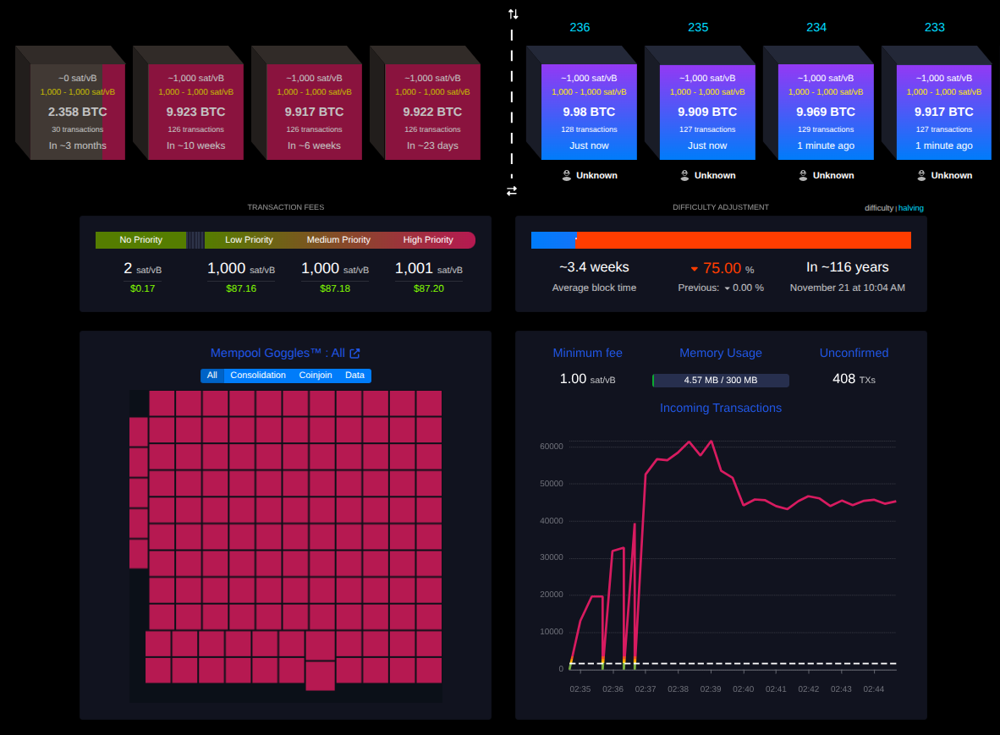

# Simchain Settings Reference

Every setting is read from `.env` by `docker-compose.yml`, and **every one has a
default**, so a missing variable (or no `.env` file at all) still works.- `.env.example`, short template with the most used settings.
- `.env.full.example`, complete template with everything below.

```bash
cp .env.example .env        # everyday version
cp .env.full.example .env   # everything tweakable
```

Settings consumed by the mining controller or the spammer (block cadence, fee floor,
block fill, spam mode) can be applied to a **running** chain without resetting it:
edit `.env`, then `docker compose up -d --force-recreate` only those services. See
"Retuning a live chain" in the README.

## Bitcoin node image

| Variable | Default | Description |
|---|---|---|
| `BTC_IMAGE` | `bitcoin/bitcoin:31.1` | Docker image used by the 3 nodes. Default is pulled from the registry (no build needed). Set `simchainbitcoinnode:31.1` to use the locally built image (`./docker/build-bitcoin-image.sh`). |
| `BITCOIN_VERSION` | `31.1` | Bitcoin Core version used by `./docker/build-bitcoin-image.sh` when building the local image. Not used by compose. |

## RPC credentials

Shared by all nodes and every tool (mining controller, spammer, reorg, electrs, explorer).

| Variable | Default | Description |
|---|---|---|
| `BTC_RPC_USER` | `foo` | RPC username. |
| `BTC_RPC_PASS` | `rpcpassword` | RPC password. |

> **Security note:** credentials are passed in plaintext on the bitcoind command line
> and are visible via `docker inspect` / `ps`. That is fine for this dev tool (throwaway
> regtest coins, private network), but do NOT replicate the pattern in production: use
> `-rpcauth` (salted hash) plus a proper secrets mechanism (Docker/Compose secrets,
> Kubernetes Secrets or a vault) instead of environment variables in compose files.

## Host port mappings

| Variable | Default | Description |
|---|---|---|
| `NODE1_RPC_PORT` | `18443` | Host port for node1 RPC (production-like endpoint). |
| `NODE1_P2P_PORT` | `18444` | Host port for node1 P2P. |
| `NODE2_RPC_PORT` | `28443` | Host port for node2 RPC (owned wallet node). |
| `NODE2_P2P_PORT` | `28444` | Host port for node2 P2P. |

Node3 is intentionally not exposed to the host.

## ZMQ notifications (node1 and node2)

node1 and node2 publish all five bitcoind ZMQ topics (`rawblock`, `rawtx`,
`hashblock`, `hashtx`, `sequence`), so ZMQ consumers (LND/CLN Lightning nodes,
ordinals indexers, block explorers, custody watchers) can run against the simnet,
including through reorgs. The variables below only change the **host** port
mappings; inside the compose network both nodes always publish on 28332-28336.

| Variable | Default | Description |
|---|---|---|
| `NODE1_ZMQ_RAWBLOCK_PORT` | `28332` | Host port for node1 `rawblock` (full serialized block). |
| `NODE1_ZMQ_RAWTX_PORT` | `28333` | Host port for node1 `rawtx` (full serialized tx). |
| `NODE1_ZMQ_HASHBLOCK_PORT` | `28334` | Host port for node1 `hashblock`. |
| `NODE1_ZMQ_HASHTX_PORT` | `28335` | Host port for node1 `hashtx`. |
| `NODE1_ZMQ_SEQUENCE_PORT` | `28336` | Host port for node1 `sequence` (mempool add/remove + block connect/disconnect, the reorg-aware topic). |
| `NODE2_ZMQ_RAWBLOCK_PORT` | `38332` | Host port for node2 `rawblock`. |
| `NODE2_ZMQ_RAWTX_PORT` | `38333` | Host port for node2 `rawtx`. |
| `NODE2_ZMQ_HASHBLOCK_PORT` | `38334` | Host port for node2 `hashblock`. |
| `NODE2_ZMQ_HASHTX_PORT` | `38335` | Host port for node2 `hashtx`. |
| `NODE2_ZMQ_SEQUENCE_PORT` | `38336` | Host port for node2 `sequence`. |

Smoke test: see the ZMQ section in the README.

## Container-internal RPC endpoints

URLs the helper tools (mining controller, spammer) use to reach the nodes on
`btc-simnet-control`. Only change them if you rename the node services or point the tools
at other nodes. Bitcoin P2P traffic uses the separate `btc-simnet-p2p` network and its
`nodeX-p2p` aliases.

| Variable | Default | Description |
|---|---|---|
| `NODE1_RPC_URL` | `http://btc-simnet-node1:18443` | Node1 RPC endpoint (the spammer watches it for new blocks). |
| `NODE2_RPC_URL` | `http://btc-simnet-node2:18443` | Node2 RPC endpoint (mining controller and spammer). |
| `NODE3_RPC_URL` | `http://btc-simnet-node3:18443` | Node3 RPC endpoint (mining controller and spammer). |

## Node policy

The three fee settings look similar but act at different points of a transaction's life:

- **`MIN_RELAY_TX_FEE`** (`-minrelaytxfee`, BTC/kvB) is the **node's floor**: the minimum
  feerate for the node to accept a transaction into its mempool and relay it to peers.
  A transaction paying below this is rejected on arrival, whoever sends it.
- **`FALLBACK_FEE`** (`-fallbackfee`, BTC/kvB) is the **wallet's guess**: the feerate the
  wallet uses when fee estimation has no data, which is always the case on a fresh
  regtest chain. Without it `sendtoaddress` fails with "Fee estimation failed". Keep it
  at or above `MIN_RELAY_TX_FEE`, or the wallet creates transactions that its own node
  refuses to relay.
- **`MAX_TX_FEE`** (`-maxtxfee`, whole BTC; an absolute amount, not a rate) is the
  **wallet's safety cap**: any wallet transaction that would pay more total fee than this
  aborts. It is set absurdly high here so spam volume never trips it (the mainnet
  default is 0.1 BTC).

| Variable | Default | Description |
|---|---|---|
| `MIN_RELAY_TX_FEE` | `0.00001` | Node mempool/relay floor (feerate, BTC/kvB). Keep at the mainnet default; see [The fee market](#the-fee-market-what-spam-pays-and-how-to-set-a-price-floor) for why it is the wrong knob for a fee floor. |
| `FALLBACK_FEE` | `0.0001` | Wallet feerate when estimation has no data (BTC/kvB). Also the simnet's floor price level: floor fills pay this rate, and DATA/HYBRID bulk spam pays a tiny premium so miners use floor fills only for residual gaps. Raising it sets an economic fee floor — see [The fee market](#the-fee-market-what-spam-pays-and-how-to-set-a-price-floor). |
| `MAX_TX_FEE` | `10000000` | Wallet cap on the total fee of one tx (whole BTC). |
| `BLOCK_RESERVED_WEIGHT` | `2000` | Regtest mining template reserve (`-blockreservedweight`, WU). Bitcoin Core defaults to reserving 8000 WU for mining RPC clients; `2000` is Core's minimum safety value and avoids most of the permanent ~7.4k-WU gap. Deviating from the Core default here *imitates mainnet*: real pools reserve just enough for their actual coinbase, so congested mainnet blocks pack to ~3,999,8xx WU — with the default 8000 the simnet's blocks would cap at ~3.993M WU, unlike anything on mainnet. Mining-template-only: consensus (4M WU) and relay/mempool policy are untouched, so all nodes still behave like stock mainnet nodes. |
| `NODE1_DISABLE_WALLET` | `1` | node1 has no wallet by default: it mimics a 3rd-party production endpoint with no hot wallet online, so the user manages keys externally and submits signed raw transactions. Set `0` to enable the wallet. |

### The fee market: what spam pays, and how to set a price floor

Both spam engines use `FALLBACK_FEE` as the price anchor; they just reach it
differently. The raw engine (`USE_RAW_TX_SPAM=true`, the default) sets fees explicitly:
floor fills pay `FALLBACK_FEE`, DATA/HYBRID bulk spam pays a tiny premium above it, and
OUTPUT-mode spam pays it directly. The wallet engine never sets a fee: every send lets
the sending node's wallet choose, the wallet asks its own fee estimator, the estimator
has no data on a fresh chain, and the wallet falls back to `FALLBACK_FEE`. With the
defaults, the floor is ~10 sat/vB.

Under the wallet engine the estimator never escapes that level either. Once it has
data, its only data is the spam itself, and all of it confirmed at the fallback
rate — so it recommends that same rate back and the spam keeps paying it.
`FALLBACK_FEE` is therefore not just a bootstrap value: it sets the simnet's price
level permanently, whichever engine is active.

That makes it a one-line **economic fee floor**. Combine a
[full-blocks recipe](#full-blocks) with, say, `FALLBACK_FEE=0.001` (100 sat/vB) and
the background traffic outbids anything cheaper: a user transaction paying more than
the spam rate jumps the queue and confirms next block; one paying less still relays
fine (the relay floor stays at 1 sat/vB), sits visibly in the mempool, and full
blocks keep passing it over — exactly how mainnet feels in a high-fee period. The
floor only exists while spam keeps blocks full; with partial blocks everything
confirms and the floor vanishes.

The cost is mostly recycled, not burned: the spam fees end up in the blocks that
node2/node3 mine, so they return to the miner wallets as coinbase after the
100-block maturity. Under the wallet engine the wallets pay those fees directly;
under the raw engine they come out of the engine's own funds, which it pulled from
the miner wallets in the first place (and pulls again when its pool drains). Either
way, only the 546-sat burn outputs really leave the loop.

**When the floor leaks: packing granularity.** Block assembly walks the mempool by
descending feerate, and when the next spam tx does not fit the space left in the
block it keeps scanning down the ladder for anything that does. A tiny transaction
fits anywhere — so it rides the leftover gap into the next block even while paying
far below the floor. The gap scales with the spam tx size: ~20k WU with
`SPAM_SENDMANY_OUTPUTS=160`, ~127k WU at 1000, ~380k WU at 3000 (hundreds of small
txs slip through per block). The rule: **the floor holds for a transaction only if
the miner can pack the residual gap with something as small, standalone and
floor-priced.** That is exactly what the DATA/HYBRID floor fill pool provides
(`SPAM_FLOOR_POOL_TXS`, on by default — see [The fee floor](#the-fee-floor)); in
OUTPUT mode big batches are for throughput and mempool-bloat demos and actively
break floor testing.

**Do not use `MIN_RELAY_TX_FEE` as the floor.** The wallets would cope — Bitcoin
Core clamps every wallet send to `max(-mintxfee, -minrelaytxfee)`, so spam would
still relay — but the semantics are wrong twice. It is policy drift: mainnet's
relay floor is 1 sat/vB, and raising it makes the simnet's nodes stop behaving like
mainnet nodes. And it turns the floor into a hard reject: a cheap user transaction
bounces at node1 with `min relay fee not met` instead of waiting in the mempool
like it would on mainnet. Fee pressure should come from traffic (tooling), not from
node policy.

Limitation: spam still sits in a very narrow fee band around whatever level you set —
fee histograms stay mostly flat and `estimatesmartfee` mostly echoes the level. A
wider spread of fee rates with real competition inside a block is a proposed feature
(nice-to-have: fee-market simulation).

## Mining controller

| Variable | Default | Description |
|---|---|---|
| `USER_ADDRESS` | `bcrt1qtmjq...tf3rr` | Address funded at startup with 2 coinbase UTxOs of 50 BTC (matured). Generate your own, see the helper gists linked in `.env.full.example`. |
| `BLOCK_INTERVAL_MEAN_SECS` | `15` | Exact seconds between blocks in fixed mode; exponential distribution mean before bounds are applied in Poisson mode. Must be a positive integer, and in Poisson mode must lie within the configured bounds (startup fails otherwise). |
| `BLOCK_INTERVAL_MODE` | `poisson` | `poisson` samples each full block-to-block interval from an exponential distribution, then applies the minimum and maximum. `fixed` always uses `BLOCK_INTERVAL_MEAN_SECS`. |
| `BLOCK_INTERVAL_MIN_SECS` | `10` | Poisson lower clamp in seconds; fractional values are accepted. Set empty for zero. Validated but does not affect fixed mode. |
| `BLOCK_INTERVAL_MAX_SECS` | `20` | Poisson upper clamp in seconds; fractional values are accepted. Set empty for unbounded. Must be greater than zero and no lower than `BLOCK_INTERVAL_MIN_SECS`. Validated but does not affect fixed mode. |
| `MINER_WEIGHTS` | _(empty)_ | Empty means strict node2/node3 alternation. Set two relative non-negative integer weights such as `70,30` to draw a miner independently for every block; `0,100` and `100,0` are valid. `50,50` is random selection, not alternation. |
| `MINING_RNG_SEED` | _(empty)_ | Optional `u64` seed for reproducible Poisson intervals and weighted miner picks. When omitted, the controller derives a seed from system time and logs it. It is parsed but has no behavioral effect while both stochastic modes are off. |
| `NODE2_WALLET_NAME` | `node2` | Wallet created on node2 by the controller, also used by the spammer. |
| `NODE3_WALLET_NAME` | `node3` | Wallet created on node3 by the controller, also used by the spammer. |

Poisson timing and weighted selection are independent: either can be enabled without
the other. They affect only continuous mining after the deterministic bootstrap through
height 204. A stochastic run logs its resolved seed, so setting that value on a later
run reproduces the same random sequence for the same configuration. Bounds clamp the
raw exponential sample rather than resampling it: values below the minimum become the
minimum and values above the maximum become the maximum. This intentionally creates
probability mass at each configured boundary and changes the observed mean;
`BLOCK_INTERVAL_MEAN_SECS` remains the mean of the underlying, pre-clamp distribution.
With either bound set, the resulting arrival process is therefore a bounded renewal
process, not a mathematically pure Poisson process; `poisson` describes the underlying
exponential sampler. Leave both bounds empty when exact Poisson-process behavior matters.
In Poisson mode the mean must lie within the bounds — a mean outside the clamp range
would pin nearly every interval to a boundary, which is almost always a leftover bound
after changing the mean, so the controller refuses to start. Fixed mode skips this check
(it ignores the bounds entirely), which is why the full-block recipes below can set a
long fixed interval while `.env` keeps the default bounds.

## Spammer

| Variable | Default | Description |
|---|---|---|
| `ENABLE_SPAM` | `true` | Spam transactions after each block so blocks are not empty. |
| `USE_RAW_TX_SPAM` | `true` | Selects the spam engine. `true`: **raw engine** — the spammer holds its own keys, tracks its own UTXO set in memory, signs every tx locally and submits with `sendrawtransaction`. The node wallets are bypassed, so the send rate stays flat forever (no wallet fatigue). Floor-fill txs pay exactly `FALLBACK_FEE`; DATA/HYBRID bulk spam pays a tiny premium so miners drain bulk first and keep floor fills for residual gaps; rare refill fan-outs pay above the floor so they confirm under saturation. `false`: **node-wallet engine** — spam is sent with `sendtoaddress`/`sendmany` on the miner wallets, so bitcoind does coin selection and signing (wallet-realistic traffic, the original behavior); throughput is bound by the wallet lock and degrades as wallet history grows (see [Full blocks](#full-blocks)). All other spam knobs apply to both engines. |
| `SPAM_FIXED_TXS_PER_BLOCK` | `100` | Fixed tx count for the **OUTPUT** spam modes (sequential/batch) and the wallet engine — the number a block explorer shows per block (plus coinbase) until blocks are full; excess waits in the mempool. Split across the miner nodes for you. **Ignored in DATA/HYBRID mode**, where the fill is driven by `SPAM_FILL_BLOCK_RATIO`. Renamed from `SPAM_TXS_PER_BLOCK` (still honored); replaces the older `SPAM_PER_MINER_PER_BLOCK` (× 2). |
| `SPAM_SENDMANY_OUTPUTS` | `0` | OUTPUT-mode fatness. `0`: sequential — one tx with a single burn output at a time, p2p-like arrival. `N > 0`: batch — each spam tx carries N burn outputs (exchange-payout-shaped). Ignored in DATA/HYBRID mode. |
| `SPAM_TX_DATA_MAX_BYTES` | `90000` | Raw engine only. `N > 0` (the default): **DATA/HYBRID mode** — the fill comes from OP_RETURN data txs (biggest payload = N). An OP_RETURN is provably unspendable, so it never enters the UTXO set: pure block weight at near-zero node cost (a handful of fat txs fill a 4M WU block vs ~1130 in output mode; measured node CPU ~100% → ~2%). Capped just under the 100k-vB standard-tx limit; needs Core 30+ (the default image). `0`: legacy OUTPUT mode (fatness from burn outputs, UTXO-heavy). Renamed from `SPAM_TX_DATA_BYTES` (still honored). See [Hybrid: varied sizes and mempool depth](#hybrid-varied-sizes-and-mempool-depth). |
| `SPAM_TX_DATA_MIN_BYTES` | `250` | Smallest data payload. Below MAX (the default): each tx's size is drawn **log-uniformly** in `[MIN, MAX]` — a realistic spread, most small and a few large. `0` (or ≥ MAX): every data tx is exactly MAX (uniform). |
| `SPAM_SMALL_TXS_PER_BLOCK` | `0` | HYBRID: this many extra minimum-size (~140 vB) floor-priced txs per block, on top of the data fill. Cosmetic — they add a stream of small realistic-looking payment-shaped txs. This is **not** the fee floor; the airtight floor is `SPAM_FLOOR_POOL_TXS`. `0`: none. |
| `SPAM_FLOOR_POOL_TXS` | `4000` | **Airtight fee floor** (DATA/HYBRID mode). Keep this many standalone floor-priced ~110-vB fill txs *standing* in the mempool at all times, split across the miners and direct-relayed to the other miner. Each fill spends a **confirmed** UTXO from a dedicated second key (never unconfirmed spam change), so its ancestor package is itself and a below-floor tx must **outbid** the floor to confirm. Mined fills recycle their change into fresh ammo (zero net UTXO-set growth). `0`: off — the floor is then **soft** (see [The fee floor](#the-fee-floor)). Ignored in OUTPUT/wallet modes. |
| `SPAM_FILL_BLOCK_RATIO` | `2.0` | DATA/HYBRID fill target, in blocks of mempool weight, measured live each block and topped up. `0.5`: half-full blocks (floor off). `1`: full blocks + a shallow backlog. `5`: full blocks + ~4 pending blocks visible in the mempool. The default is `2`, not `1`, because the mempool oscillates ~1 block around the target between top-ups (measured: ratio 2 rides ~1.2–2.2 blocks): `2` keeps a full block of floor-priced supply in front of every template so the fee floor stays airtight, while `1` rides the trough and can leave an occasional partial block (the floor leaks that block). |
| `SPAM_FANOUT_AUTO` | `true` | DATA/HYBRID: auto-size the branch pool from the fill ratio. `true`: use `max(12, ceil(ratio × 15))` branches (a deep pool is needed to hold that many blocks of unconfirmed spam). `false`: use `SPAM_FANOUT_UTXOS`, erroring at startup if it is below the `ratio × 10` minimum. |
| `SPAM_FANOUT_UTXOS` | `50` | The spammer keeps its funds split into this many independent UTXOs ("branches"), replenishing when the pool runs low. The mempool caps unconfirmed chains at 25 txs / 101k vB, so without the split a single UTXO can place only ~25 txs per block. In DATA/HYBRID mode this is overridden by the auto value unless `SPAM_FANOUT_AUTO=false`. `0` disables (OUTPUT/wallet only). |
| `ENABLE_SPAM_REPLACES` | `false` | `true` or `1`: every spam tx signals RBF (BIP125) and, right after each batch, the newest `SPAM_REPLACES_PER_MINER_PER_BLOCK` txs per miner are fee-bumped with `bumpfee`, so the mempool carries real replacements (old txid evicted, new txid appears) for downstream code to handle. `false`/`0`: exactly today's behavior. |
| `SPAM_REPLACES_PER_MINER_PER_BLOCK` | `5` | How many of each miner's spam txs are fee-bumped per block when `ENABLE_SPAM_REPLACES` is on. The newest txs are bumped (a tx with unconfirmed descendants cannot be replaced). |

### Full blocks

The nodes keep Bitcoin Core's consensus-default block weight (4M WU, ~7,100 small
spam txs), so filling blocks is purely a question of feeding the mempool fast enough.
A 1-in/2-out spam tx is ~561 WU; sequential sending is bound by RPC round-trips
(~22 accepted tx/s on a mid-range desktop). The measured numbers in this section
were taken with the wallet engine (`USE_RAW_TX_SPAM=false`); the raw engine
(default) is substantially faster at the same settings — check your real cycle time
in the `Spam cycle done in ...` log line. Two ready-made setups:

Fast full blocks, under 1 minute each (batch mode):

```bash
BLOCK_INTERVAL_MODE=fixed
BLOCK_INTERVAL_MEAN_SECS=60
SPAM_FIXED_TXS_PER_BLOCK=360
SPAM_SENDMANY_OUTPUTS=100     # 360 batches x ~12.7k WU ≈ 4.6M WU offered > 4M cap
```

Measured on a mid-range desktop: blocks land at ~3.98M WU (99.7% of the cap) and the
send cycle takes ~40–55s, so the occasional block right after a UTXO re-split comes
out partial; use `BLOCK_INTERVAL_MEAN_SECS=90` if every single block must be full.

The spam outputs pay burn addresses (no known key), not wallet addresses, and that
is what makes sustained full blocks possible: bitcoind's coin selection scans the
whole wallet on every send, so when the spam used to pay the other miner's wallet,
each full block grew that wallet by `SPAM_FIXED_TXS_PER_BLOCK × SPAM_SENDMANY_OUTPUTS`
dust UTXOs (~18k) until the send cycle no longer fit any interval (measured: 54s
fresh → 15+ min after ~2h). Burned dust never enters a wallet; the miners only keep
their own change, so the cycle time stays flat. The cost is a slow drain, ~0.16 BTC
per full block against a ~2550 BTC bootstrap balance — thousands of blocks of margin.
The spammer works both wallets in parallel (one thread per miner node), so the
cycle is bound by the slower half, not the sum. If blocks still come out partial,
check the real cycle time in `docker logs btc-simnet-spammer` (the
`Spam cycle done in ...` line each round) and keep `BLOCK_INTERVAL_MEAN_SECS` above it.
If the cycle time *grows* over the session instead, that is wallet fatigue:
bitcoind keeps the whole wallet tx history in memory and scans it on every send
(measured: ~13s cycle fresh → ~67s after ~50 full blocks). It is inherent to
wallet-based spam, i.e. to `USE_RAW_TX_SPAM=false`; the raw engine (default) is
immune — its bookkeeping is a constant-size in-memory UTXO set, so switching back
to it is the structural fix. Wallet-engine resets: a stack restart
(`docker compose down -v`) or lowering the offered tx count.

With `BLOCK_INTERVAL_MODE=poisson`, `BLOCK_INTERVAL_MEAN_SECS` is only the underlying
mean: individual gaps will routinely be shorter than the spam cycle even when the mean
is longer. A block after a short gap uses the standing floor pool and whatever the
previous cycle left in the mempool, so it may be partially filled. This is expected and
intentionally mirrors mainnet backlog drawdown after closely spaced blocks. Set
`BLOCK_INTERVAL_MIN_SECS` when a test requires a guaranteed preparation window, or raise
the mean (together with `BLOCK_INTERVAL_MAX_SECS` — the mean must stay within the
bounds) or the standing mempool depth for fuller blocks more often. Use fixed mode if
every cycle must receive exactly the same amount of time.

Sequential p2p-like arrival (`SPAM_SENDMANY_OUTPUTS=0`), full blocks:

```bash
BLOCK_INTERVAL_MODE=fixed
BLOCK_INTERVAL_MEAN_SECS=420  # ~330s minimum at 22 tx/s; 420s reserves for slower machines
SPAM_FIXED_TXS_PER_BLOCK=8000
SPAM_FANOUT_UTXOS=200         # 4000 txs per wallet need >= 160 independent 25-tx chains
```

With shorter sequential intervals blocks fill proportionally
(`fill ≈ interval × send_rate / 7100`), so expect ~5.5–7 minutes per full block
depending on machine speed.

Data mode makes blocks heavy with *data* instead of *transactions* — the thing that
loads a node (signature checks, mempool package math, and, in output/batch mode, a
UTXO-set insert per output: measured ~31k new UTXOs per full block). An OP_RETURN
output is provably unspendable, so it never enters the UTXO set. About 11 max-size
(90k-byte) txs fill a 4M WU block versus ~1130 in batch mode, so the per-tx work
collapses: on the same machine that sat pegged at ~100% node CPU under batch spam,
data mode runs at **~2% node CPU**, blocks still ~99% full, the send cycle under a
second. It is the way to run *fast* full blocks without the nodes — or your machine —
becoming the limit. The recommended way to use it is **HYBRID mode** below (a spread of
sizes + a few small txs), not a single fixed size.

### Hybrid: varied sizes and mempool depth

HYBRID mode fills blocks with data txs of *varied* sizes (a realistic mempool look)
plus a few small txs, and keeps the mempool a chosen number of blocks deep:

```bash
SPAM_TX_DATA_MAX_BYTES=90000   # biggest OP_RETURN payload (cheap bulk weight)
SPAM_TX_DATA_MIN_BYTES=250     # spread each tx's size log-uniformly in [MIN, MAX]
SPAM_SMALL_TXS_PER_BLOCK=40    # small realistic payment-shaped txs (cosmetic)
SPAM_FLOOR_POOL_TXS=4000       # standing 110-vB standalone fills -> airtight floor (see below)
SPAM_FILL_BLOCK_RATIO=2        # keep ~2 blocks of weight pending in the mempool
FALLBACK_FEE=0.001             # 100 sat/vB floor; bulk DATA pays a small premium
```

`SPAM_FILL_BLOCK_RATIO` is measured live each block and topped up, so it controls both
fullness *and* mempool depth from one dial: `0.5` → half-full blocks (an uncongested
chain), `1` → full blocks with a shallow backlog, `5` → full blocks with ~4 pending
blocks visible in mempool.space. The branch pool auto-sizes to the ratio
(`SPAM_FANOUT_AUTO=true` → `max(12, ratio × 15)` branches); a deep pool is needed
because the mempool caps each unconfirmed chain at ~101k vB, so holding `R` blocks of
unconfirmed spam needs about `R × 10` branches. Sizes verified live spanning ~141 vB
(smallest) to ~88k vB in a single mempool; node CPU stays low and the UTXO set barely
grows (only the small txs add outputs).

### The fee floor

Raising `FALLBACK_FEE` with full blocks makes the estimator and mempool.space show a
price floor (e.g. floor fills at 100 sat/vB while bulk DATA sits just above it). Whether
that floor is **airtight** against tiny below-floor transactions depends on
`SPAM_FLOOR_POOL_TXS`.

**The problem (with `SPAM_FLOOR_POOL_TXS=0`, a soft floor).** Every data/sealer spam tx
chains off a branch, so only a branch-count of them are *standalone* (mineable into a
small gap on their own); the rest are chain tips whose ancestor package is far too big
to fit a gap. And any floor-priced tx the engine makes gets *mined* (it pays the floor),
so none persist to guard the residual gap. Blocks therefore pack to ~98–99%, not 100%,
and a cheap tiny tx (below the floor rate) slips into the leftover ~12–17k-vB packing
gap and confirms next block — visible as the `No Priority` band at ~1–2 sat/vB.
`SPAM_SMALL_TXS_PER_BLOCK` gap-sealers tighten packing and raise the bar (the floor
holds for any tx *larger* than the gap) but do not close it for the smallest txs.

**The fix (`SPAM_FLOOR_POOL_TXS > 0`, default `4000`, airtight).** The engine maintains a
standing pool of standalone floor-priced ~110-vB self-transfers *sitting in the mempool
at all times*, from a dedicated second key. Each fill spends a **confirmed** pool UTXO --
never unconfirmed change -- so its ancestor package is itself and block assembly can
drop many of them into residual gaps. A below-floor tx must **outbid** the floor to
confirm.
Each block, mined fills recycle their change into fresh confirmed ammo, so the pool churns
~1:1 and holds at the target with **zero net UTXO-set growth** (self-transfers spend one
output and create one) and near-idle nodes. The spammer also direct-relays floor fills to
the other miner by RPC, so both rotating miners see the same floor inventory without
waiting on P2P relay; bulk DATA txs stay on the owner-node path to keep cycles short. The
pool only applies in DATA/HYBRID mode and only while blocks are actually full
(`SPAM_FILL_BLOCK_RATIO >= 1`); at `ratio < 1` blocks are partial by design and everything
confirms regardless.

### Market pressure floor to 100 sats/vB (legacy OUTPUT recipe)
Full blocks with 100 sat/vB on every tx, using OUTPUT-mode batch spam:
```bash
BLOCK_INTERVAL_MODE=fixed
BLOCK_INTERVAL_MEAN_SECS=15
ENABLE_SPAM=true
SPAM_FIXED_TXS_PER_BLOCK=250
SPAM_SENDMANY_OUTPUTS=250
FALLBACK_FEE=0.001

```
Kept for wallet-realistic burn-output traffic. Note the trade-offs vs the default
DATA/HYBRID + floor-pool setup: much higher node CPU (every output is a UTXO-set
insert), and the floor is **not** airtight for tiny transactions (no standing fill
pool in OUTPUT mode — see [When the floor leaks](#the-fee-market-what-spam-pays-and-how-to-set-a-price-floor)).

## Reorg simulator (profile `reorg`)

| Variable | Default | Description |
|---|---|---|
| `REORG_DEPTH` | `3` | How many blocks to orphan per reorg. CLI argument overrides it: `./scripts/simulate-reorg.sh 5`. |
| _(CLI only)_ `empty` | off | Per-run argument, not an env var: `./scripts/simulate-reorg.sh 3 empty` mines empty replacement blocks (chaos reorg) and leaves the orphaned txs unconfirmed, instead of re-mining them. Chosen per run so real and empty reorgs can be interleaved on the same chain. |
| `REORG_MODE` | `once` | `once` = single reorg then exit. `auto` = reorg every `AUTO_REORG_EVERY_BLOCKS`. |
| `AUTO_REORG_EVERY_BLOCKS` | `20` | Auto mode cadence (x); must be greater than `REORG_DEPTH` (y). |
| `REORG_NODE` | `btc-simnet-node3` | Node used to fork the chain (a hidden miner is realistic). |
| `REORG_NODE_RPC_PORT` | `18443` | RPC port of `REORG_NODE` inside the compose network. |
| `REORG_MINE_ADDRESS` | `bcrt1qtmjq...tf3rr` | Address receiving the replacement block rewards. **The default is the same address as `USER_ADDRESS`'s default** (intentional), so after a reorg plus 100 blocks of maturity the user balance grows beyond the bootstrap 2x50 BTC. Set a separate throwaway address if your test asserts exact user balances. |
| `REORG_ADDS_NEW_TXS` | `5` | Fresh wallet txs seeded into the reorg node's mempool before mining, modelling a node that received transactions its peers have not yet seen; they are mined into the winning chain alongside the returned txs. `0` disables. Ignored for `empty` reorgs. To match spammed block fullness, set it near `SPAM_FIXED_TXS_PER_BLOCK` (OUTPUT mode). |
| `REORG_DOUBLE_SPEND_PCT` | `0` | Percentage (`0`–`100`) of the **eligible orphaned wallet txs on the reorg node** to permanently drop, by mining a same-input, different-output conflict into the replacement chain so the originals can never re-confirm. `0` keeps today's behavior (orphaned txs re-mined unchanged); ignored for `empty` reorgs. Applies **only** to txs the reorg node's own wallet can re-sign (its wallet-engine spam), and only to root orphaned txs (not descendants of another orphaned tx). With the default `USE_RAW_TX_SPAM=true` there may be **zero** eligible txs; set `USE_RAW_TX_SPAM=false` to exercise it. Selection is deterministic (oldest orphaned block first) and `1`–`100` always selects at least one eligible tx. See [REORGS.md](./REORGS.md). |
| `REORG_WALLET_NAME` | `NODE3_WALLET_NAME` (`node3`) | Wallet used to send the `REORG_ADDS_NEW_TXS` transactions on the reorg node, and to sign the `REORG_DOUBLE_SPEND_PCT` conflicts. Falls back to the first loaded wallet if it is not loaded. |
| `REORG_WITNESS_NODE` | `btc-simnet-node1` | Node polled after mining the replacements to confirm the whole network adopted the new chain. If the mining controller extended the old chain during the reorg window (tie), extra blocks are mined (up to 10) until the witness follows the new tip. `none` disables the check. |

Orphaned transactions return to the mempool automatically. The replacement blocks are
filled by re-reading the mempool live and mining slices of it with `generateblock`, like
the winning chain of a real reorg, so the replacements are normally as full as the blocks
they replace. Reading the mempool fresh for each block means an RBF replacement that
evicts an orphaned tx mid-reorg (e.g. with `ENABLE_SPAM_REPLACES=true`) is picked up
automatically instead of leaving the block referencing a stale txid — no single rejection
can cascade the rest of the run to empty blocks.

## Network partitions and P2P netem

`scripts/partition.sh run` is post-bootstrap-only and refuses to proceed below height
204. Its CLI block-count options override these script defaults:

| Variable | Default | Description |
|---|---|---|
| `PARTITION_MAIN_BLOCKS` | `3` | Blocks mined by the connected-side miner during `partition.sh run`. Must be a positive integer and differ from `PARTITION_ISOLATED_BLOCKS`. |
| `PARTITION_ISOLATED_BLOCKS` | `4` | Blocks mined by the isolated miner during `partition.sh run`. Must be a positive integer and differ from `PARTITION_MAIN_BLOCKS`. |
| `PARTITION_CONVERGENCE_TIMEOUT_SECS` | `60` | Maximum time to wait after healing for all three best-block hashes to match. |
| `PARTITION_PEER_TIMEOUT_SECS` | `15` | Maximum time to wait for P2P peer connections to reflect a requested split. |

Netem has no persistent settings: pass `--delay-ms` and `--loss-pct` to
`scripts/netem.sh apply` (or use `scripts/degrade.sh`, the settings-free wrapper that
adds a duration and auto-restore). It affects only the interface routed to the fixed
`btc-simnet-p2p` subnet (`172.30.0.0/24`), never the RPC/control interface, and shapes
egress only — `--delay-ms 500` adds 500ms one way (RTT +500ms); apply it on both
endpoints for symmetric latency. Its qdisc is ephemeral and disappears when the target
node restarts.

## Scenario engine (profile `scenario`)

The scenario engine is a one-shot post-bootstrap orchestrator. Relative file paths are
resolved from the repository root mounted at `/workspace` in the container.

| Variable | Default | Description |
|---|---|---|
| `SCENARIO_FILE` | `/workspace/scenarios/pause-then-burst.yml` | YAML scenario to validate and execute. On the host, paths such as `scenarios/reorg-during-sync.yml` are accepted. |
| `SCENARIO_TIMEOUT_SECS` | `1800` | Positive global timeout used while waiting for RPC, bootstrap, requested heights, and mining-controller restart. |
| `SCENARIO_RESULT_FILE` | _(empty)_ | Optional JSON result path. Relative paths resolve under `/workspace`; the artifact records success, executed/total steps, duration, final height/hash, and the first error. |
| `SIMCHAIN_REPO_ROOT` | `/workspace` | Repository mount containing compose, helper scripts, and scenario files. Normally set only by compose. |

Node RPC URLs, credentials, and miner wallet names use the shared settings above. The
profile mounts `/var/run/docker.sock` because pause/resume, reorg, and partition actions
drive existing compose/script surfaces. Treat access to this container as root-equivalent
host access. Full schema and execution semantics: [SCENARIOS.md](SCENARIOS.md).

## Simchain control plane (profile `control-plane`; alias `panel`)

The control plane is an opt-in localhost web UI + HTTP API + MCP endpoint for live retuning
(see [RETUNING.md](RETUNING.md)). Mining and spam control use private authenticated
worker APIs, and reorg jobs use those worker leases plus Bitcoin RPC directly. The
service still mounts `/var/run/docker.sock` only for transitional boot/lifecycle
compatibility scheduled for removal in Phase 7; runtime worker control and reorg jobs
do not use it. Treat access to this container as root-equivalent host access until that
migration removes the mount.

| Variable | Default | Description |
|---|---|---|
| `CONTROL_PLANE_PORT` | `8090` | Host port (bound to `127.0.0.1` only) for the browser UI, the `/api/v1` JSON API, and the `/mcp` MCP endpoint. |
| `CONTROL_PLANE_API_TOKEN` | _(empty)_ | Bearer token required on every mutation and the whole `/mcp` endpoint. Empty generates `.simchain-control/token` (mode 0600, gitignored), reused across restarts. |
| `SIMCHAIN_CONTROL_STATE_DIR` | `.simchain-control` | Narrow directory for the token, atomically written desired state, and bounded job metadata/JSONL events. |
| `MINING_CONTROL_URL` | `http://btc-simnet-mining-controller:9081` | Private Compose-network endpoint used by the control plane; never publish this port to the host. |
| `MINING_CONTROL_LISTEN_ADDR` | `0.0.0.0:9081` | Mining worker's private control listener. Boot-only. |
| `SPAM_CONTROL_URL` | `http://btc-simnet-spammer:9082` | Private Compose-network spam endpoint; never publish this port to the host. |
| `SPAM_CONTROL_LISTEN_ADDR` | `0.0.0.0:9082` | Resident spam worker's private control listener. Boot-only. |
| `SIMCHAIN_INTERNAL_TOKEN` | `simchain-internal-dev-token` | Shared bearer token for control-plane-to-worker requests. Supply the same non-empty value to all three services when overriding it. |

Control-plane-managed runtime settings (durable desired values live in
`.simchain-control/state.json`; Phase 3 still mirrors these keys to `.env` for manual
compatibility, preserving everything else verbatim):

- Mining controller scope: `BLOCK_INTERVAL_MODE`, `BLOCK_INTERVAL_MEAN_SECS`,
  `BLOCK_INTERVAL_MIN_SECS`, `BLOCK_INTERVAL_MAX_SECS`, `MINER_WEIGHTS`,
  `MINING_RNG_SEED`.
- Spammer scope: `ENABLE_SPAM`, `USE_RAW_TX_SPAM`, `FALLBACK_FEE`,
  `SPAM_FIXED_TXS_PER_BLOCK`, `SPAM_SENDMANY_OUTPUTS`, `SPAM_TX_DATA_MAX_BYTES`,
  `SPAM_TX_DATA_MIN_BYTES`, `SPAM_SMALL_TXS_PER_BLOCK`, `SPAM_FLOOR_POOL_TXS`,
  `SPAM_FILL_BLOCK_RATIO`, `SPAM_FANOUT_AUTO`, `SPAM_FANOUT_UTXOS`,
  `ENABLE_SPAM_REPLACES`, `SPAM_REPLACES_PER_MINER_PER_BLOCK`.

Node-level settings (`BTC_IMAGE`, host ports, `MIN_RELAY_TX_FEE`, ZMQ,
`BLOCK_RESERVED_WEIGHT`, credentials, ...) are deliberately not control-plane-managed: they are
not safe live retunes.

## Tools: electrs (profiles `electrs`, `mempool`, `all-tools`)

| Variable | Default | Description |
|---|---|---|
| `ELECTRS_IMAGE` | `mempool/electrs:v3.3.0` | electrs image. |
| `ELECTRS_ELECTRUM_PORT` | `60001` | Host port for the Electrum RPC. |
| `ELECTRS_HTTP_PORT` | `3000` | Host port for the esplora-style HTTP API. |

## Tools: mempool.space explorer (profiles `mempool`, `all-tools`)

| Variable | Default | Description |
|---|---|---|
| `MEMPOOL_FRONTEND_IMAGE` | `mempool/frontend:v3.3.1` | Explorer web frontend image. |
| `MEMPOOL_BACKEND_IMAGE` | `mempool/backend:v3.3.1` | Explorer API backend image. |
| `MEMPOOL_WEB_PORT` | `1080` | Host port for the explorer UI (http://localhost:1080/). |
| `MARIADB_IMAGE` | `mariadb:10.5.8` | Database image for the explorer. |
| `MEMPOOL_DB_USER` | `mempool` | Explorer DB user. |
| `MEMPOOL_DB_PASS` | `mempool` | Explorer DB password. |
| `MEMPOOL_DB_ROOT_PASS` | `admin` | Explorer DB root password. |

# Mempool space picture with market pressure floor at 1000 sats/vB


